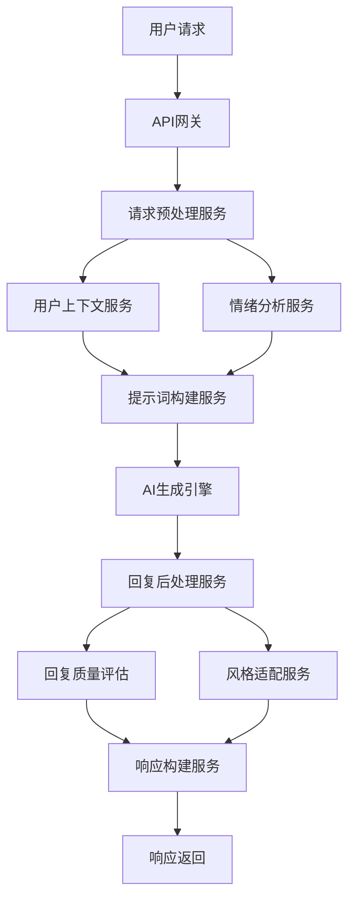
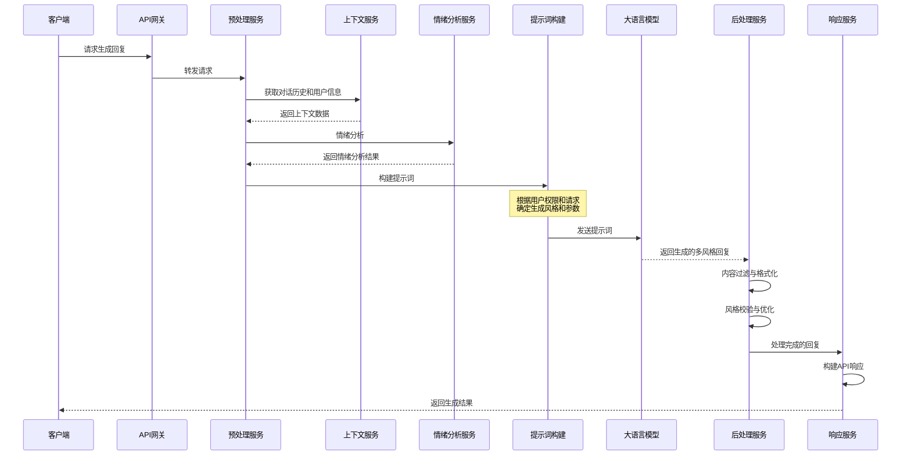
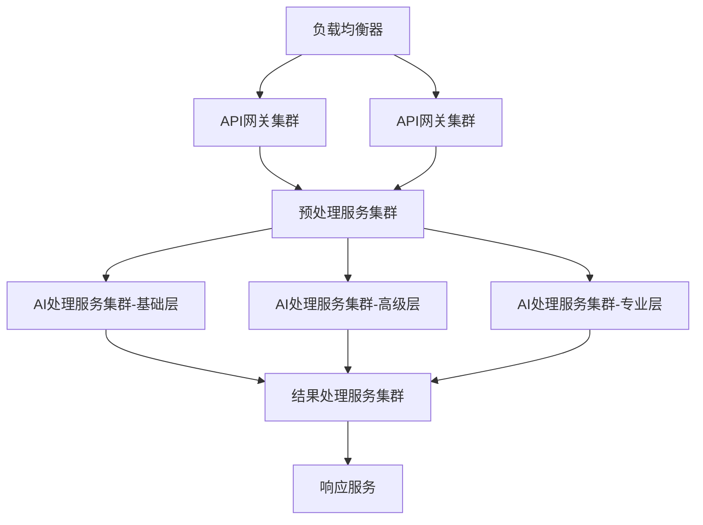
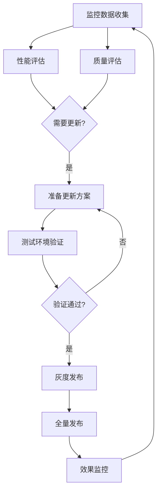
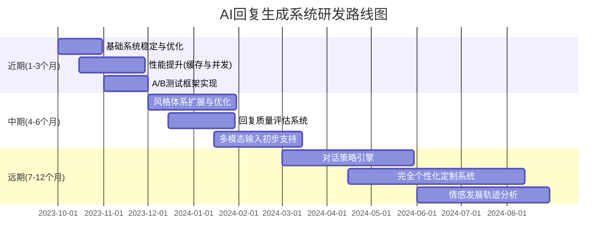

# AI回复生成系统架构与实现

## 1. 系统概述

AI回复生成系统是「语撩」应用的核心技术引擎，负责根据用户输入的聊天内容，结合上下文信息和用户偏好，生成多种风格的聊天回复建议。系统采用多层级的提示词工程框架，基于大语言模型(LLM)构建，通过精细的上下文处理、情感分析和风格定制，提供高质量的回复内容。

## 2. 系统架构

### 2.1 整体架构



### 2.2 核心组件

1. **请求预处理服务**：验证输入，提取关键信息，准备处理上下文
2. **用户上下文服务**：获取和管理对话历史与用户偏好信息
3. **情绪分析服务**：分析对方消息的情绪、意图和关系阶段
4. **提示词构建服务**：根据分析结果和用户需求构建多层级提示词
5. **AI生成引擎**：调用大语言模型API生成多风格回复
6. **回复后处理服务**：对生成内容进行过滤、优化和格式化
7. **风格适配服务**：确保生成内容符合目标风格特征
8. **回复质量评估**：评估回复质量，筛选最佳回复

### 2.3 扩展组件

1. **用户偏好学习服务**：分析用户互动行为，优化个性化推荐
2. **内容安全过滤服务**：确保生成内容符合内容安全标准
3. **多模态处理服务**：处理图片、语音等非文本输入
4. **统计分析服务**：收集和分析生成质量和用户反馈数据

## 3. 技术实现

### 3.1 基础技术栈

- **核心框架**：Spring Boot 3.0
- **AI引擎接入**：Spring AI / 自研AI封装层
- **数据存储**：
  - MongoDB：存储对话历史和生成结果
  - Redis：缓存用户会话和频繁访问数据
  - MySQL：用户账户和配置信息
- **向量数据库**: milvus，用于语义搜索和相似度匹配
- **消息队列**：Kafka/RabbitMQ，处理异步任务和事件通知
- **监控与日志**：ELK Stack + Prometheus + Grafana

### 3.2 AI模型选型

根据不同场景和需求，系统使用多种模型组合：

1. **主要生成模型**：
   - 基础模型：GPT-3.5-Turbo（高性价比，快速响应）

2. **辅助模型**：
   - 情感分析模型：专用情感分析微调模型
   - 内容审核模型：安全性检查专用模型
   - 风格分类模型：风格匹配和质量评估模型

### 3.3 提示词工程框架

系统采用多层级提示词构建方法，包括：

```
<系统角色与基础指令>
你是一个专业的约会回复助手，帮助用户生成有吸引力、自然的回复消息。

<用户信息与偏好>
用户性别：{gender}
年龄：{age}
偏好回复风格：{preferredStyles}
回复长度偏好：{lengthPreference}

<会话上下文>
聊天阶段：{relationshipStage}
最近消息历史：
{previousMessages}

<对方信息>
性别：{receiverGender}
估计年龄：{receiverAgeRange}
沟通特点：{communicationStyle}

<当前消息分析>
收到的消息："{receivedMessage}"
消息类型：{messageType}
情感状态：{emotionalState}
兴趣水平：{interestLevel}
关键话题：{keyTopics}

<回复风格指南>
请生成以下风格的回复：
1. {style1Name}: {style1Description}
2. {style2Name}: {style2Description}
...

对于每种风格，请确保：
- 回复自然、得体且有吸引力
- 保持适当长度({targetLength})
- 避免过于刻板或公式化的表达
- 包含1-2个问题以延续对话
- 传达适当的情感强度({emotionalIntensity})

为每种风格分别生成不同的回复，不要在风格间复制内容。
```

### 3.4 风格定义体系

系统定义了一套结构化的风格参数体系：

```json
{
  "styleId": "humorous",
  "name": "幽默风趣型",
  "description": "轻松诙谐，巧妙风趣，让对话充满乐趣",
  "parameters": {
    "tone": "light-hearted",
    "energy": "high",
    "formality": "casual",
    "creativity": "high",
    "emotionExpression": "expressive",
    "questionStyle": "curious"
  },
  "patternExamples": [
    "使用巧妙的双关语",
    "添加夸张但不过度的比喻",
    "偶尔自嘲，展现自信与幽默",
    "使用机智的反问"
  ],
  "avoidPatterns": [
    "过度夸张或低俗笑话",
    "对敏感话题的不恰当玩笑",
    "嘲讽或贬低语言"
  ],
  "promptModifiers": "添加幽默元素，使用轻松诙谐的表达方式，适当使用双关语或俏皮说法，保持对话有趣而不失礼貌"
}
```

## 4. 核心流程实现

### 4.1 生成流程详解



### 4.2 情绪分析实现

情绪分析服务负责分析接收到的消息，提取情感状态、意图和兴趣水平：

```java
@Service
public class EmotionAnalysisService {
    
    @Autowired
    private AIClient aiClient;
    
    @Autowired
    private EmotionPatternRepository patternRepo;
    
    public EmotionAnalysisResult analyze(String message, ConversationContext context) {
        // 1. 基于规则的快速分析
        EmotionAnalysisResult quickResult = quickAnalysis(message);
        
        // 2. 低分值消息或复杂消息使用AI深度分析
        if (needsDeepAnalysis(quickResult, message)) {
            return deepAnalysis(message, context, quickResult);
        }
        
        return quickResult;
    }
    
    private EmotionAnalysisResult quickAnalysis(String message) {
        // 基于关键词、标点符号和模式匹配的快速分析
        // 分析情感词、问题数量、表情符号等表层特征
        // ...实现代码...
        
        return new EmotionAnalysisResult();
    }
    
    private boolean needsDeepAnalysis(EmotionAnalysisResult quickResult, String message) {
        // 判断是否需要进行更深入的AI分析
        return quickResult.getConfidence() < 0.7 || 
               message.length() > 100 || 
               quickResult.isAmbiguous();
    }
    
    private EmotionAnalysisResult deepAnalysis(String message, ConversationContext context, 
                                              EmotionAnalysisResult quickResult) {
        // 构建情感分析提示词
        String prompt = buildEmotionAnalysisPrompt(message, context, quickResult);
        
        // 调用AI获取详细情感分析
        String aiResponse = aiClient.completion(prompt);
        
        // 解析AI响应
        return parseEmotionAnalysisResponse(aiResponse);
    }
}
```

### 4.3 提示词构建实现

提示词构建服务负责根据用户信息、上下文和分析结果构建高效的LLM提示词：

```java
@Service
public class PromptEngineeringService {
    
    @Autowired
    private StyleRepository styleRepo;
    
    @Autowired
    private PromptTemplateRepository templateRepo;
    
    @Autowired
    private UserPreferenceService preferenceService;
    
    public String buildGenerationPrompt(GenerationRequest request, 
                                       EmotionAnalysisResult emotion,
                                       ConversationContext context,
                                       UserProfile userProfile) {
        // 1. 获取基础模板
        String baseTemplate = templateRepo.getBaseTemplate();
        
        // 2. 处理请求的风格信息
        List<StyleDefinition> styles = getRequestedStyles(request, userProfile);
        
        // 3. 构建风格部分提示词
        String stylesPrompt = buildStylesPrompt(styles);
        
        // 4. 构建用户信息部分
        String userInfoPrompt = buildUserInfoPrompt(userProfile);
        
        // 5. 构建上下文部分
        String contextPrompt = buildContextPrompt(context);
        
        // 6. 构建情感分析部分
        String emotionPrompt = buildEmotionPrompt(emotion);
        
        // 7. 组装完整提示词
        return String.format(baseTemplate, 
                            userInfoPrompt,
                            contextPrompt, 
                            "收到的消息: \"" + request.getReceivedMessage() + "\"",
                            emotionPrompt,
                            stylesPrompt);
    }
    
    private List<StyleDefinition> getRequestedStyles(GenerationRequest request, UserProfile userProfile) {
        // 根据请求和用户权限获取风格定义
        List<StyleDefinition> result = new ArrayList<>();
        
        for (String styleId : request.getStyles()) {
            StyleDefinition style = styleRepo.findById(styleId);
            
            // 检查用户是否有权限使用此风格
            if (style.isVipOnly() && !userProfile.isVip()) {
                continue;  // 跳过VIP专属风格
            }
            
            result.add(style);
        }
        
        // 确保至少有一种风格
        if (result.isEmpty()) {
            result.add(styleRepo.getDefaultStyle());
        }
        
        return result;
    }
    
    private String buildStylesPrompt(List<StyleDefinition> styles) {
        StringBuilder sb = new StringBuilder("请生成以下风格的回复：\n");
        
        for (int i = 0; i < styles.size(); i++) {
            StyleDefinition style = styles.get(i);
            sb.append(i+1).append(". ")
              .append(style.getName()).append(": ")
              .append(style.getDescription()).append("\n")
              .append("   ").append(style.getPromptModifiers()).append("\n\n");
        }
        
        return sb.toString();
    }
    
    // 其他构建方法的具体实现...
}
```

### 4.4 后处理与质量控制

回复后处理服务负责确保生成内容的质量和安全性：

```java
@Service
public class ResponsePostProcessingService {
    
    @Autowired
    private ContentFilterService contentFilter;
    
    @Autowired
    private StyleValidationService styleValidator;
    
    @Autowired
    private QualityEvaluationService qualityEvaluator;
    
    public List<ProcessedReply> processGeneratedReplies(
            List<GeneratedReply> rawReplies, 
            List<StyleDefinition> requestedStyles,
            EmotionAnalysisResult emotion) {
        
        List<ProcessedReply> processedReplies = new ArrayList<>();
        
        for (int i = 0; i < rawReplies.size(); i++) {
            GeneratedReply raw = rawReplies.get(i);
            StyleDefinition targetStyle = requestedStyles.get(i);
            
            // 1. 内容安全过滤
            String filteredContent = contentFilter.filter(raw.getContent());
            if (contentFilter.isRejected(filteredContent)) {
                // 内容被拒绝，使用备用内容
                filteredContent = getFallbackContent(targetStyle);
            }
            
            // 2. 风格符合度验证
            StyleValidationResult validation = styleValidator.validate(filteredContent, targetStyle);
            if (validation.getScore() < 0.7) {
                // 风格不符合，进行调整
                filteredContent = styleValidator.adjust(filteredContent, targetStyle);
            }
            
            // 3. 质量评估
            QualityScore quality = qualityEvaluator.evaluate(filteredContent, emotion);
            
            // 4. 格式化处理
            String finalContent = formatReply(filteredContent);
            
            // 创建处理后的回复对象
            ProcessedReply processed = new ProcessedReply(
                raw.getReplyId(),
                targetStyle.getStyleId(),
                finalContent,
                validation.getScore(),
                quality
            );
            
            processedReplies.add(processed);
        }
        
        // 按质量分数排序
        return processedReplies.stream()
                .sorted(Comparator.comparing(reply -> -reply.getQuality().getTotalScore()))
                .collect(Collectors.toList());
    }
    
    private String getFallbackContent(StyleDefinition style) {
        // 获取预定义的安全回复内容
        return "抱歉，无法为这个话题提供合适的回复建议。可以尝试其他话题或表达方式。";
    }
    
    private String formatReply(String content) {
        // 清理多余空白、规范标点、修复明显文本问题等
        return content.trim()
                     .replaceAll("\\s+", " ")
                     .replaceAll("([。！？；：，、])+", "$1");
    }
}
```

## 5. 关键AI算法实现

### 5.1 情感分析算法

```java
public class EmotionAnalyzer {
    
    // 情感词典
    private final Map<String, Double> sentimentLexicon;
    // 增强词典
    private final Map<String, Double> intensifierLexicon;
    // 否定词典
    private final Set<String> negationWords;
    
    public EmotionScore analyzeSentiment(String text) {
        double sentimentScore = 0.0;
        double intensityScore = 0.0;
        
        // 分词处理
        List<String> tokens = tokenize(text);
        
        // 滑动窗口分析
        for (int i = 0; i < tokens.size(); i++) {
            String token = tokens.get(i);
            
            // 检查情感词
            if (sentimentLexicon.containsKey(token)) {
                double score = sentimentLexicon.get(token);
                
                // 检查前面的否定词
                if (i > 0 && negationWords.contains(tokens.get(i-1))) {
                    score = -score;
                }
                
                // 检查前面的增强词
                if (i > 0 && intensifierLexicon.containsKey(tokens.get(i-1))) {
                    score *= intensifierLexicon.get(tokens.get(i-1));
                }
                
                sentimentScore += score;
                intensityScore += Math.abs(score);
            }
        }
        
        // 标点符号和表情符号处理
        double emojiScore = analyzeEmojis(text);
        double punctuationScore = analyzePunctuation(text);
        
        // 综合评分
        return new EmotionScore(
            normalize(sentimentScore, -5, 5, -1, 1),
            normalize(intensityScore, 0, 10, 0, 1),
            normalize(emojiScore + punctuationScore, 0, 5, 0, 1)
        );
    }
    
    // 其他辅助分析方法...
}
```

### 5.2 风格调整算法

```java
public class StyleAdjuster {
    
    private final Map<String, List<String>> stylePatterns;
    private final Map<String, Double> styleWeights;
    
    public String adjustToStyle(String content, StyleDefinition style) {
        // 1. 提取风格关键特征
        Map<String, Object> styleFeatures = extractStyleFeatures(style);
        
        // 2. 分析当前内容
        Map<String, Object> contentFeatures = analyzeContent(content);
        
        // 3. 确定需要调整的方向
        List<AdjustmentOperation> adjustments = determineAdjustments(
            styleFeatures, contentFeatures);
        
        // 4. 应用调整
        String adjusted = content;
        for (AdjustmentOperation op : adjustments) {
            adjusted = applyAdjustment(adjusted, op);
        }
        
        return adjusted;
    }
    
    private Map<String, Object> extractStyleFeatures(StyleDefinition style) {
        Map<String, Object> features = new HashMap<>();
        
        // 提取关键特征如语气、正式程度、创造性等
        features.put("tone", style.getParameters().get("tone"));
        features.put("formality", style.getParameters().get("formality"));
        features.put("creativity", style.getParameters().get("creativity"));
        features.put("emotionExpression", style.getParameters().get("emotionExpression"));
        
        // 提取关键模式和表达方式
        features.put("patterns", style.getPatternExamples());
        features.put("avoidPatterns", style.getAvoidPatterns());
        
        return features;
    }
    
    private String applyAdjustment(String content, AdjustmentOperation op) {
        switch (op.getType()) {
            case TONE_SHIFT:
                return adjustTone(content, op.getTarget());
            case FORMALITY_SHIFT:
                return adjustFormality(content, op.getTarget());
            case ADD_PATTERN:
                return addStylePattern(content, op.getPattern());
            case REMOVE_PATTERN:
                return removePattern(content, op.getPattern());
            // 其他调整类型...
            default:
                return content;
        }
    }
    
    // 具体调整方法的实现...
}
```

### 5.3 质量评估算法

```java
public class ReplyQualityEvaluator {
    
    public QualityScore evaluateReply(String reply, 
                                     String originalMessage, 
                                     EmotionAnalysisResult emotion,
                                     StyleDefinition targetStyle) {
        // 1. 相关性评分
        double relevanceScore = evaluateRelevance(reply, originalMessage);
        
        // 2. 情感匹配度
        double emotionMatchScore = evaluateEmotionMatch(reply, emotion);
        
        // 3. 风格符合度
        double styleMatchScore = evaluateStyleMatch(reply, targetStyle);
        
        // 4. 自然流畅度
        double fluencyScore = evaluateFluency(reply);
        
        // 5. 互动性评分
        double interactionScore = evaluateInteraction(reply);
        
        // 加权计算总分
        double totalScore = 
            relevanceScore * 0.25 +
            emotionMatchScore * 0.20 +
            styleMatchScore * 0.25 +
            fluencyScore * 0.15 +
            interactionScore * 0.15;
        
        return new QualityScore(
            totalScore,
            relevanceScore,
            emotionMatchScore,
            styleMatchScore,
            fluencyScore,
            interactionScore
        );
    }
    
    private double evaluateRelevance(String reply, String originalMessage) {
        // 使用余弦相似度等方法计算相关性
        // ...
        return 0.0;
    }
    
    // 其他评分函数的实现...
}
```

## 6. 性能优化与扩展

### 6.1 性能优化策略

1. **请求批处理**：
   - 将多风格生成合并为单一LLM请求
   - 使用JSON模式指定输出格式，便于解析

2. **分层缓存策略**：
   - L1缓存：内存缓存常用风格模板和分析结果
   - L2缓存：Redis缓存用户上下文和近期对话历史
   - L3缓存：类似请求的生成结果缓存

3. **异步处理**：
   - 非关键路径处理（如数据分析、用户反馈处理）移至异步队列
   - 使用事件驱动架构减少同步依赖

4. **资源弹性扩展**：
   - 根据负载自动扩展处理节点
   - 实现请求优先级队列，保证VIP用户服务质量

### 6.2 系统水平扩展



### 6.3 AI模型冗余与备份

为保证系统高可用性，实现多级备份方案：

1. **模型冗余**：
   - 主模型：GPT-4/3.5
   - 备用模型：Claude 2.1
   - 紧急备用：本地轻量级模型

2. **降级策略**：
   - 主模型超时或错误时自动切换备用模型
   - 所有云端模型不可用时，使用本地模型生成基础回复
   - 极端情况下返回预定义的模板回复

3. **灾备方案**：
   - 跨区域部署，保证全球访问稳定性
   - 实施固定比例流量分配，防止单一服务商故障

## 7. 数据安全与隐私保护

### 7.1 数据安全策略

1. **用户数据保护**：
   - 对话内容存储采用端到端加密
   - 敏感信息脱敏处理，避免AI模型接触原始数据
   - 实施严格的数据访问控制和审计

2. **AI生成内容安全**：
   - 多层内容过滤，包括关键词、模式和AI内容审核
   - 禁止生成违反法规、不适当或歧视性内容
   - 对潜在风险内容添加使用警告

3. **提示词注入防护**：
   - 输入内容预处理，过滤潜在攻击模式
   - 系统提示词使用特殊标记，防止用户干扰
   - 输出内容验证，确保符合预期格式

### 7.2 隐私保护实现

```java
@Service
public class PrivacyProtectionService {
    
    @Autowired
    private SensitiveDataDetector sensitiveDetector;
    
    @Autowired
    private DataAnonymizer anonymizer;
    
    @Autowired
    private PrivacyConfigurationService privacyConfig;
    
    public String processUserMessage(String message, UserProfile user) {
        // 1. 检测并脱敏个人敏感信息
        message = sensitiveDetector.detectAndRedact(message, user.getPrivacyLevel());
        
        // 2. 根据用户隐私设置额外处理
        if (user.getPrivacySettings().isHighPrivacy()) {
            message = anonymizer.fullAnonymize(message);
        }
        
        return message;
    }
    
    public ConversationContext prepareConversationContext(
            ConversationContext original, UserProfile user) {
        
        // 根据数据保留策略决定历史记录范围
        int retentionDays = user.getPrivacySettings().getChatHistoryRetention();
        Date cutoffDate = DateUtils.addDays(new Date(), -retentionDays);
        
        // 过滤掉过期消息
        List<MessagePair> filteredHistory = original.getRecentMessages().stream()
                .filter(msg -> msg.getTimestamp().after(cutoffDate))
                .collect(Collectors.toList());
        
        // 创建新的上下文对象
        ConversationContext filtered = new ConversationContext();
        filtered.setUserProfile(user);
        filtered.setRecentMessages(filteredHistory);
        filtered.setCurrentTopic(original.getCurrentTopic());
        filtered.setCurrentTopicTurns(original.getCurrentTopicTurns());
        filtered.setLastResponseTime(original.getLastResponseTime());
        
        return filtered;
    }
}
```

## 8. 监控与维护

### 8.1 系统监控指标

1. **性能指标**：
   - 平均响应时间（按用户等级、功能类型分类）
   - AI模型调用成功率和延迟
   - 各处理阶段时间分布
   - 系统资源使用率

2. **业务指标**：
   - 回复生成请求数量（按时间段、用户类型）
   - 不同风格使用比例
   - 用户喜欢/不喜欢反馈率
   - 内容过滤触发率

3. **质量指标**：
   - 回复质量平均分
   - 风格符合度分布
   - 生成错误率
   - 用户反馈一致性

### 8.2 告警与通知体系

建立多层次告警体系：

```
严重性1(紧急): 
- 系统宕机或核心功能不可用
- AI模型全部不可用
- 数据泄露或安全事件
=> 电话+短信+邮件通知，24×7处理

严重性2(高):
- 响应时间超过阈值(VIP用户>5秒，普通用户>10秒)
- AI模型部分不可用
- 错误率超过5%
=> 短信+邮件通知，工作时间立即处理

严重性3(中):
- 性能下降但在可接受范围
- 非核心功能异常
- 单个用户会话问题
=> 邮件通知，下一工作日处理

严重性4(低):
- 质量偏差，非功能性问题
- 监控数据异常但无直接影响
=> 系统记录，周级别处理
```

### 8.3 模型与提示词更新流程



## 9. 持续优化策略

### 9.1 指标导向的优化循环

建立以下数据驱动优化循环：

1. **数据收集**：收集用户反馈和系统性能数据
2. **问题识别**：定期分析数据，识别需改进的领域
3. **方案制定**：制定有针对性的优化方案
4. **A/B测试**：在小范围内测试优化方案
5. **效果评估**：比较测试结果与基准指标
6. **全面部署**：推广有效的优化方案
7. **持续监控**：监测长期效果，重复优化循环

### 9.2 A/B测试框架

为优化AI生成效果，实施结构化A/B测试框架：

```java
@Service
public class ABTestingService {
    
    @Autowired
    private ABTestConfigRepository configRepo;
    
    @Autowired
    private UserAssignmentService userAssignment;
    
    @Autowired
    private MetricsCollector metricsCollector;
    
    public AIGenerationConfig getTestConfig(String userId, String testName) {
        // 获取当前活跃测试
        ABTest test = configRepo.getActiveTest(testName);
        if (test == null) {
            return getDefaultConfig();
        }
        
        // 确定用户属于哪个测试组
        String variant = userAssignment.getVariant(userId, test);
        
        // 返回对应的配置
        return test.getConfigForVariant(variant);
    }
    
    public void recordOutcome(String userId, String testName, OutcomeMetrics metrics) {
        // 记录测试结果
        ABTest test = configRepo.getActiveTest(testName);
        if (test == null) {
            return;
        }
        
        String variant = userAssignment.getVariant(userId, test);
        metricsCollector.recordTestOutcome(testName, variant, userId, metrics);
    }
    
    public ABTestResults analyzeResults(String testName) {
        // 分析测试结果，计算统计显著性
        ABTest test = configRepo.getActiveTest(testName);
        List<OutcomeMetrics> controlMetrics = metricsCollector.getMetricsForVariant(testName, "control");
        List<OutcomeMetrics> treatmentMetrics = metricsCollector.getMetricsForVariant(testName, "treatment");
        
        // 执行统计分析
        return performStatisticalAnalysis(controlMetrics, treatmentMetrics);
    }
}
```

### 9.3 质量反馈循环

建立回复质量闭环反馈机制：

1. **用户反馈收集**：
   - 直接反馈（喜欢/不喜欢按钮）
   - 间接反馈（是否复制、实际使用）
   - 文本反馈（问题报告、改进建议）

2. **反馈分析**：
   - 聚类分析识别共性问题
   - 按风格和场景分类的问题模式
   - 持续成功与持续失败案例对比

3. **优化实施**：
   - 提示词工程优化
   - 风格参数调整
   - 特定场景专项优化
   - 内容过滤规则更新

## 10. 未来发展路线

### 10.1 技术演进计划

近期规划的功能和技术升级：

1. **多模态输入处理**：
   - 图片理解能力，分析对方发送的图片内容
   - 语音输入优化，提供基于对方语音特点的回复建议
   - 场景识别，根据用户所处场景提供情境化建议

2. **高级个性化**：
   - 从用户历史对话中学习个人语言风格
   - 为VIP用户提供风格定制功能
   - 基于关系发展阶段的动态风格调整

3. **智能化提升**：
   - 对话策略推荐，提供整体沟通建议
   - 情感发展路径预测
   - 互动质量评估与改进建议

### 10.2 研发路线图



### 10.3 技术挑战与解决方案

面临的主要挑战和应对策略：

1. **大模型成本控制**：
   - 实施多级模型架构，根据需求复杂度选择适当模型
   - 优化提示词减少token消耗
   - 精细化缓存策略减少重复调用
   - 封装自研模型用于特定场景

2. **多语言支持**：
   - 构建多语言风格库
   - 语言检测与自动切换
   - 文化适应性提示词设计
   - 针对特定语言的质量验证机制

3. **内容安全风险**：
   - 多层内容安全过滤
   - 持续更新安全规则库
   - 实施行为监测与异常检测
   - 用户举报和人工审核机制