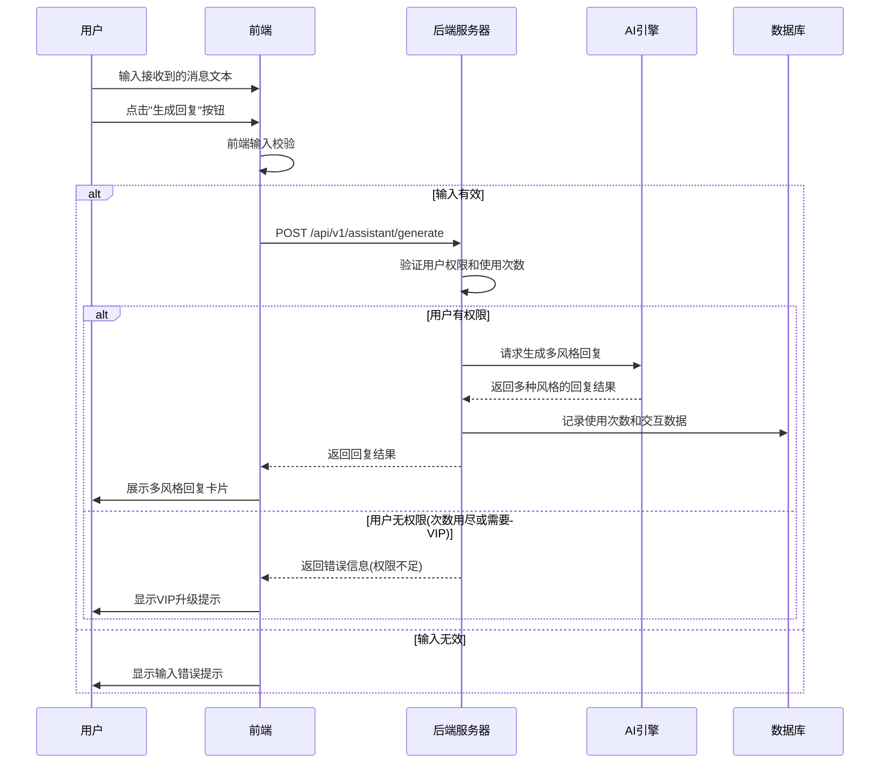
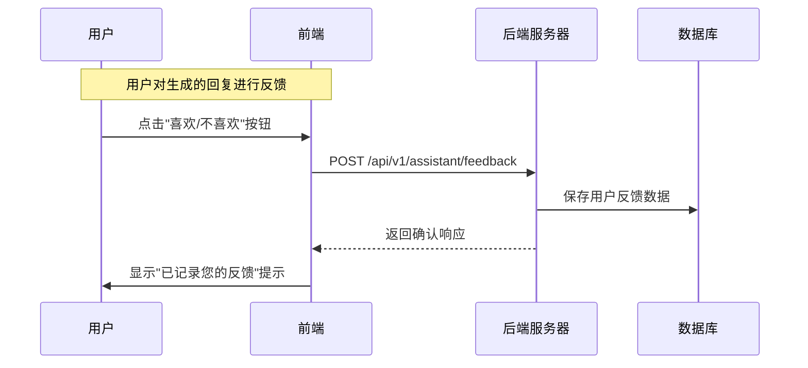
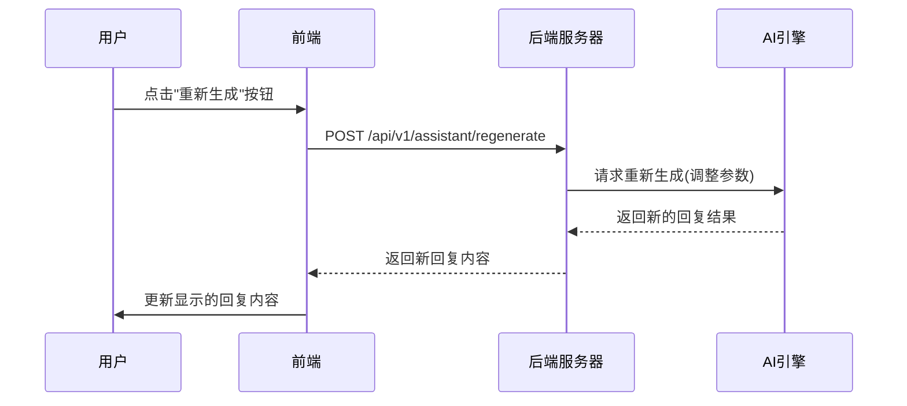

# 回复助手页面交互逻辑

## 1. 页面概述

回复助手页面是「语撩」的核心功能页面，用户输入收到的消息后，AI根据用户的偏好设置自动生成回复建议，用户可以选择不同的风格，复制或修改后使用。

## 2. 页面组件与功能

### 2.1 主要组件

- **导航栏**：品牌标识、页面切换链接
- **输入区域**：多行文本框，用于输入对方的消息
- **风格选择栏**：可横向滚动的风格选项列表
- **回复结果区**：AI生成的多个风格回复卡片
- **操作按钮**：生成、复制、重新生成
- **用量指示器**：显示当日已使用/总可用次数
- **VIP推广条**：面向免费用户展示的会员推广

### 2.2 风格类别

1. **基础风格**（免费用户可用）
   - 友好礼貌型
   - 简洁直接型
   - 关心体贴型

2. **高级风格**（VIP用户专属）
   - 幽默风趣型
   - 浪漫甜蜜型
   - 神秘吸引型
   - 知性成熟型
   - 欲擒故纵型
   - ...其他特色风格

### 2.3 交互功能

- **消息输入**：支持文本粘贴、输入历史记录
- **风格切换**：选择不同风格后即时刷新回复内容
- **结果操作**：复制到剪贴板、喜欢/不喜欢反馈、微调生成参数
- **长度控制**：选择生成简短/适中/详细回复
- **会话历史**：可查看和恢复之前的生成记录

## 3. 前后端交互流程

### 3.1 生成回复流程



### 3.2 用户对回复反馈流程



### 3.3 重新生成流程



## 4. API接口设计

### 4.1 生成回复接口

**请求：**
```
POST /api/v1/assistant/generate
Content-Type: application/json
Authorization: Bearer {token}

{
  "receivedMessage": "你周末有空吗？想约你出来喝咖啡",
  "context": {
    "previousMessages": [  // 可选，之前的消息上下文
      {"role": "receiver", "content": "你好呀，很高兴认识你"},
      {"role": "sender", "content": "你好，我也很高兴认识你"}
    ],
    "relationshipStage": "initial",  // 关系阶段: initial/developing/close
    "receiverInfo": {  // 可选，提供对方信息以提高回复质量
      "gender": "male",
      "estimatedAge": "20s"
    }
  },
  "preferences": {
    "styles": ["friendly", "humorous", "romantic"],  // 请求生成的风格
    "length": "medium",  // short/medium/detailed
    "emotionalTone": "positive"  // positive/neutral/reserved
  }
}
```

**响应：**
```json
{
  "code": "000000",
  "msg": "成功",
  "data": {
    "requestId": "生成请求ID",
    "replies": [
      {
        "replyId": "回复1ID",
        "style": "friendly",
        "content": "周末有空的，一起喝咖啡很不错呀！你有什么喜欢的咖啡馆吗？",
        "metadata": {
          "emotionalIndex": 85,  // 情感指数
          "interestLevel": "high", // 兴趣水平评估
          "wordCount": 20
        }
      },
      {
        "replyId": "回复2ID",
        "style": "humorous",
        "content": "我的周末日程表上写着'等待一个喝咖啡的邀请'，看来我得打个勾了！你有地方推荐吗？",
        "metadata": {
          "emotionalIndex": 88,
          "interestLevel": "high",
          "wordCount": 30
        }
      },
      {
        "replyId": "回复3ID",
        "style": "romantic",
        "content": "和你一起喝咖啡的机会，我怎么舍得错过呢？周末很期待见到你。",
        "metadata": {
          "emotionalIndex": 92,
          "interestLevel": "very_high",
          "wordCount": 18
        }
      }
    ],
    "usage": {
      "dailyUsed": 5,       // 今日已使用次数
      "dailyLimit": 20,     // 每日可用次数上限
      "remaining": 15       // 剩余次数
    },
    "analysisResult": {  // VIP用户可见
      "messageType": "invitation",  // 消息类型分析
      "topEmotions": ["excitement", "interest"],  // 主要情绪
      "suggestedTopics": ["coffee", "weekend plans"]  // 建议话题
    }
  }
}
```

### 4.2 回复反馈接口

**请求：**
```
POST /api/v1/assistant/feedback
Content-Type: application/json
Authorization: Bearer {token}

{
  "replyId": "回复ID",
  "feedback": "like",  // like/dislike
  "reason": "tone",    // 可选，反馈原因
  "comment": "很喜欢这个风格的表达方式"  // 可选，详细评论
}
```

**响应：**
```json
{
  "code": "000000",
  "msg": "成功",
  "data": {
    "feedbackId": "反馈ID",
    "userPreferenceUpdated": true,  // 是否已更新用户偏好
    "recommendations": {  // 可选，基于反馈的推荐
      "recommendedStyles": ["humorous", "flirty"]
    }
  }
}
```

### 4.3 获取使用统计接口

**请求：**
```
GET /api/v1/assistant/usage-stats
Authorization: Bearer {token}
```

**响应：**
```json
{
  "code": "000000",
  "msg": "成功",
  "data": {
    "daily": {
      "used": 12,
      "limit": 20,
      "remaining": 8,
      "resetTime": "2023-06-16T00:00:00Z"  // 次数重置时间
    },
    "total": {
      "messagesProcessed": 156,
      "repliesGenerated": 468,
      "favoriteStyles": ["humorous", "friendly"]
    },
    "vipBenefits": {  // VIP相关信息
      "isVip": false,
      "additionalLimit": 180,  // 升级VIP可增加的次数
      "additionalStyles": 6    // 升级VIP可解锁的风格数量
    }
  }
}
```

## 5. AI模型参数

### 5.1 输入提示词结构

AI系统使用多层级的提示词结构:

```
<系统角色与指令>
你是一个专业的约会回复助手，帮助用户生成有吸引力的回复。

<用户信息与偏好>
用户性别: {gender}
用户偏好的回复风格: {preferredStyles}
回复长度偏好: {lengthPreference}

<会话上下文>
{previousMessages}

<对方信息>
性别: {receiverGender}
估计年龄: {receiverAge}
关系阶段: {relationshipStage}

<当前消息>
对方消息: {receivedMessage}

<回复风格要求>
请生成以下风格的回复:
1. {requestedStyle1}: {styleDescription1}
2. {requestedStyle2}: {styleDescription2}
...

请确保回复自然、有吸引力，且符合指定风格。每种风格的回复都应当独立生成。
```

### 5.2 风格定义参数

| 风格ID | 风格名称 | 风格描述参数 |
|-------|---------|-------------|
| friendly | 友好礼貌型 | 亲切、得体、适度热情、保持适当距离 |
| humorous | 幽默风趣型 | 轻松、诙谐、富有创意、使用双关语或幽默表达 |
| romantic | 浪漫甜蜜型 | 感性、情感丰富、带有恰当的浪漫暗示、富有画面感 |
| mysterious | 神秘吸引型 | 不完全透露信息、保持一定神秘感、引发好奇、若即若离 |
| intellectual | 知性成熟型 | 理性、深度、展现洞察力和思考、适度引用或分享知识 |
| caring | 关心体贴型 | 展现关怀、体贴入微、聆听理解、给予情感支持 |
| assertive | 自信果断型 | 直接、坚定、有主见、适度挑战、展现领导力 |
| playful | 俏皮挑逗型 | 活泼、调皮、适度暧昧、制造轻松氛围 |

## 6. 前端交互细节

### 6.1 输入验证规则

| 验证项 | 规则 | 提示信息 |
|-------|-----|---------|
| 输入消息 | 非空且长度5-500字符 | "请输入有效的消息内容(5-500字符)" |
| 敏感内容 | 不包含违规词汇 | "消息包含不适当内容，请修改后重试" |

### 6.2 加载状态处理

- 生成回复过程中显示骨架屏加载动画
- 回复卡片依次淡入显示，创造流畅体验
- 长时间加载(>5秒)显示"AI正在思考中..."提示

### 6.3 复制功能实现

```javascript
// 复制回复内容至剪贴板
function copyToClipboard(replyText) {
  navigator.clipboard.writeText(replyText)
    .then(() => {
      // 显示复制成功提示
      showToast('已复制到剪贴板');
      
      // 记录复制事件
      trackEvent('reply_copied', {
        replyLength: replyText.length,
        replyStyle: currentStyle
      });
    })
    .catch(err => {
      console.error('复制失败:', err);
      showToast('复制失败，请手动复制');
    });
}
```

## 7. 会员营销策略

### 7.1 免费用户限制与引导

- **使用次数限制**：每日20次，重置时间为北京时间00:00
- **风格限制**：仅开放3种基础风格
- **分析功能限制**：不显示情感分析和话题建议
- **引导时机**：
  1. 使用次数达到50%时，首次显示小型VIP提示
  2. 使用次数达到80%时，显示明显的VIP推广
  3. 次数用尽时，显示全屏VIP转化弹窗

### 7.2 VIP差异化展示

VIP用户可获得以下专属功能，并在界面上有明确标识：

- **专属风格标签**：VIP风格卡片显示专属标识
- **无限生成次数**：不显示次数限制，改为使用统计
- **高级分析面板**：显示消息类型、情感分析和话题建议
- **优先处理**：请求处理优先级提高，减少等待时间
- **定制化选项**：显示更多参数调整选项(语气、措辞等)

### 7.3 转化触发点设计

1. **特定场景触发**：
   - 用户连续使用同一风格3次以上时，推荐VIP专属风格
   - 在周五/周六晚间(约会高峰)使用时，提供限时优惠

2. **功能体验触发**：
   - 允许免费用户每日尝试1次VIP风格，体验后显示VIP升级提示
   - "预览VIP功能"按钮，点击后展示VIP专属功能预览

3. **社交证明触发**：
   - 显示"已有X位用户升级VIP后提升了聊天成功率"
   - 展示匿名成功案例和转化故事

## 8. 数据分析与优化

### 8.1 关键指标追踪

- **风格受欢迎度**：各种风格被选择和复制的比率
- **转化节点**：用户从输入到复制的转化率
- **满意度评分**：用户对生成回复的喜欢/不喜欢反馈
- **会话持续性**：同一用户在短时间内多次使用的频率
- **VIP转化率**：免费用户升级VIP的比例和触发点分析

### 8.2 A/B测试计划

可进行的A/B测试实验：

1. **风格排序**：测试不同的风格展示顺序对选择率的影响
2. **UI布局**：对比卡片式vs列表式回复展示的效果
3. **提示文案**：测试不同的VIP推广文案和触发时机
4. **价格策略**：测试不同的价格点和促销方式对转化的影响
5. **功能限制**：测试不同的免费功能开放策略对用户留存的影响

### 8.3 用户行为分析模型

```
用户参与度分数 = w1*使用频率 + w2*风格多样性 + w3*反馈活跃度 + w4*复制率

其中:
- 使用频率: 过去7天内的使用天数
- 风格多样性: 用户尝试不同风格的数量/总风格数
- 反馈活跃度: 提供反馈的回复比例
- 复制率: 复制使用的回复占生成回复的比例
- w1,w2,w3,w4为权重系数
```

根据参与度分数划分用户层级，针对不同层级用户制定相应的营销和留存策略。 