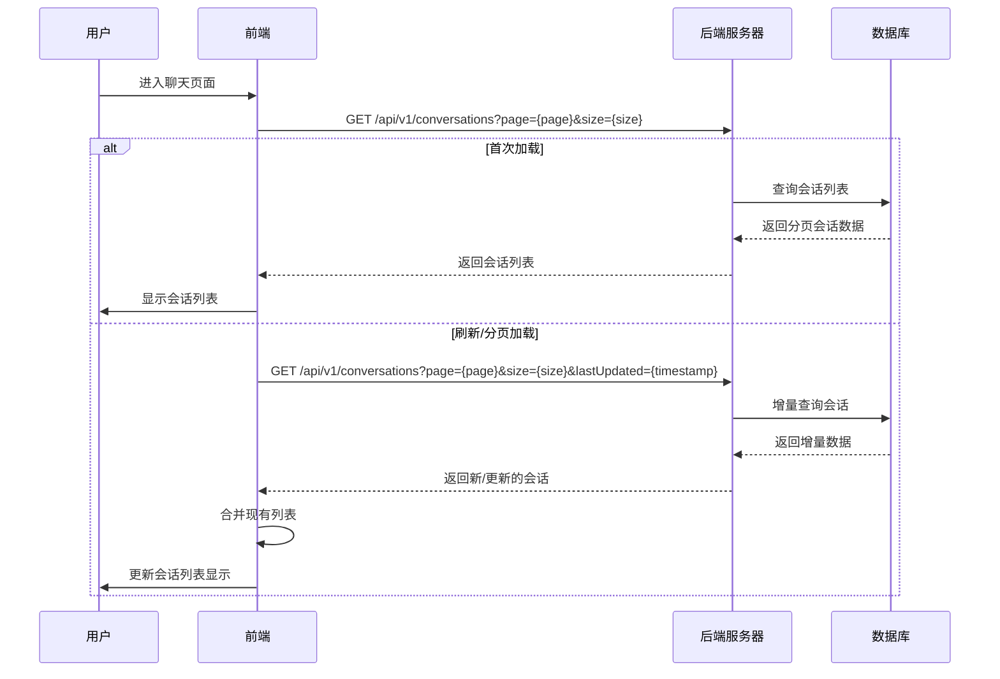
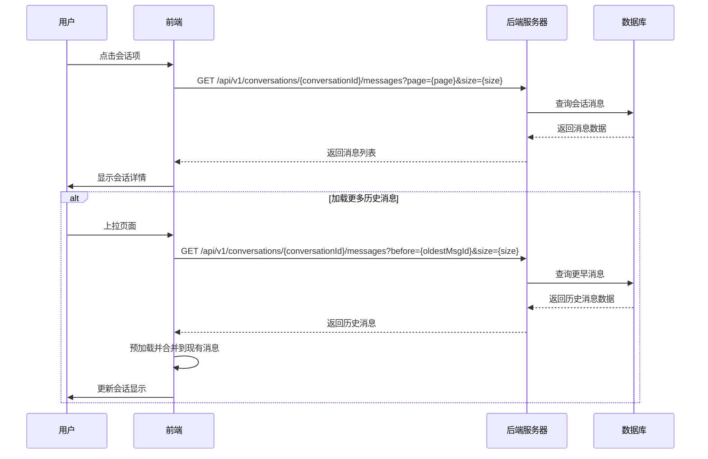
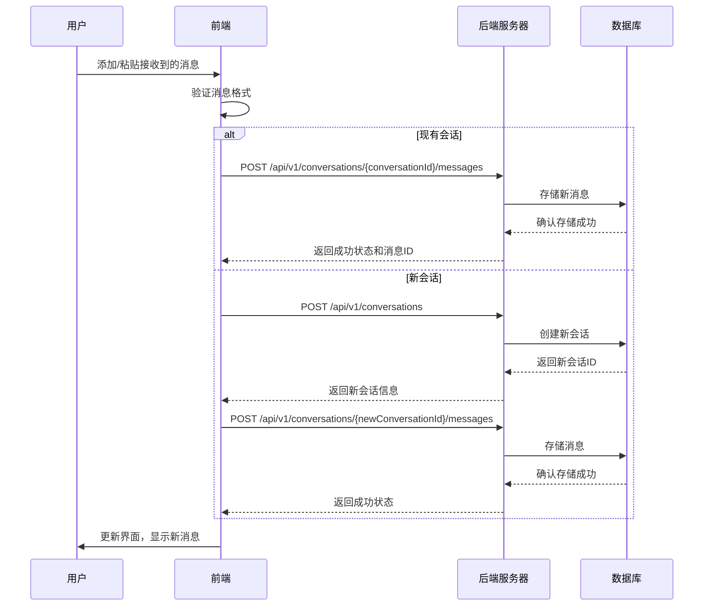
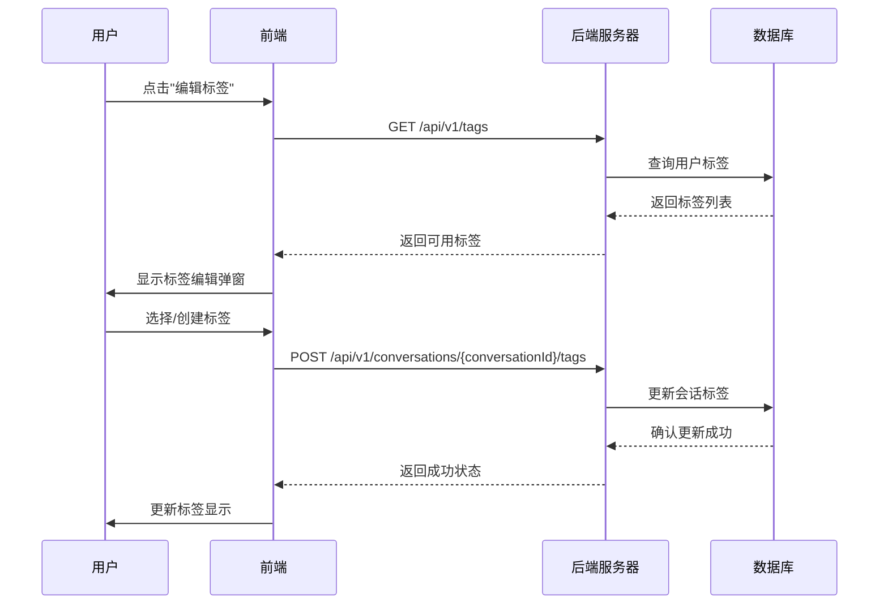
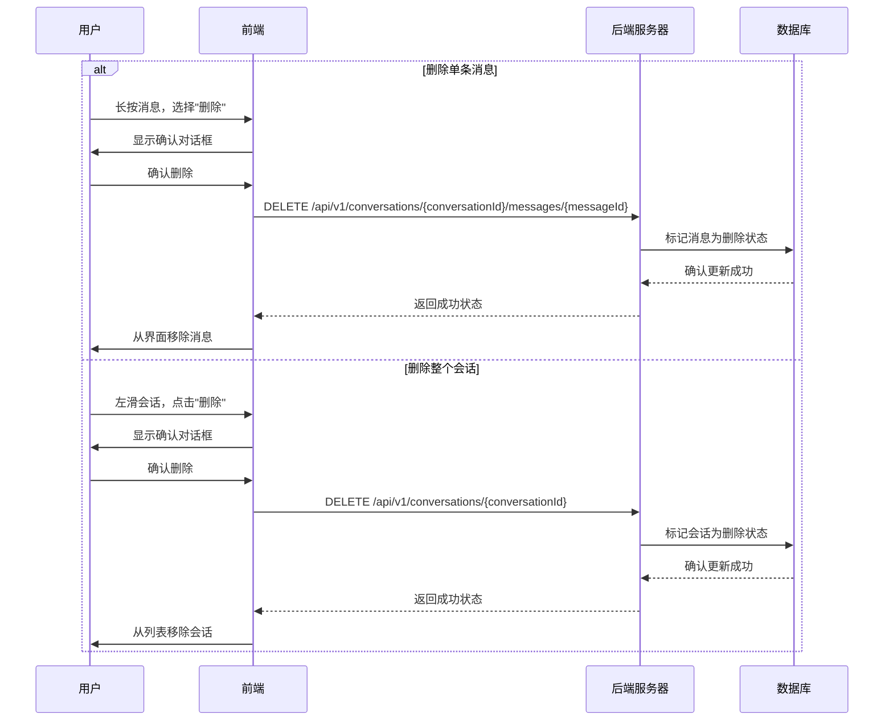
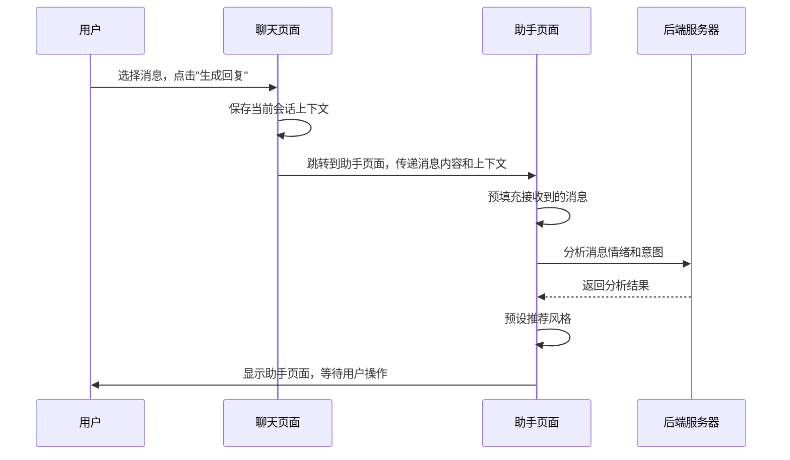

# 聊天页面交互逻辑

## 1. 页面概述

聊天页面是「语撩」应用中用户输入接收到的消息并查看、管理多个会话的核心界面。该页面允许用户存储来自各种社交平台的对话，并按会话分类管理。用户可以在此页面查看消息历史、选择会话进行回复生成，以及管理会话标签和收藏状态。

## 2. 页面结构与组件

### 2.1 主要组件

- **页面顶部区域**：应用品牌标识、搜索栏和设置入口
- **会话列表面板**：显示多个会话的预览和状态
- **会话详情区域**：显示选定会话的完整聊天记录
- **会话管理工具栏**：包含会话标签、收藏、删除等功能
- **新建会话按钮**：允许用户创建新的会话记录
- **底部导航栏**：应用主要功能区域切换

### 2.2 会话列表组件

会话列表展示用户已保存的对话，每个会话项包含：

- 对话对象头像/名称
- 最近消息预览
- 消息时间戳
- 会话标签指示（如：工作、朋友、约会等）
- 收藏状态指示（星标）
- 未读消息数量（如适用）

### 2.3 会话详情组件

展示当前选中会话的详细内容，包括：

- 对话对象信息区（头像、名称、设置）
- 时序聊天消息展示区（支持上拉加载历史）
- 消息类型指示（接收的消息/生成的回复/已使用的回复）
- 消息时间戳和状态指示
- 消息搜索和跳转功能

### 2.4 会话操作组件

提供会话管理和操作功能：

- "生成回复"按钮（将选中消息发送到助手页面）
- "复制消息"功能
- "标记收藏"功能
- "删除消息"功能
- "编辑标签"功能

## 3. 前后端交互流程

### 3.1 获取会话列表流程



### 3.2 获取会话详情流程



### 3.3 保存新消息流程



### 3.4 管理会话标签流程



### 3.5 删除会话/消息流程



### 3.6 转发消息到助手页面流程



## 4. API接口设计

### 4.1 获取会话列表接口

**请求：**
```
GET /api/v1/conversations
?page={pageNumber}
&size={pageSize}
&tag={tagId}
&lastUpdated={timestamp}
&sortBy={field}
&sortOrder={asc|desc}
Authorization: Bearer {token}
```

**参数说明：**
- `page`: 分页页码，默认为1
- `size`: 每页数量，默认为20
- `tag`: 可选，按标签筛选
- `lastUpdated`: 可选，增量加载时使用
- `sortBy`: 排序字段，默认为lastMessageTime
- `sortOrder`: 排序方向，默认为desc

**响应：**
```json
{
  "code": "000000",
  "msg": "成功",
  "data": {
    "conversations": [
      {
        "conversationId": "conv123",
        "contactName": "张三",
        "contactAvatar": "https://example.com/avatars/zhangsan.jpg",
        "lastMessage": {
          "content": "明天有空一起吃饭吗？",
          "type": "received",
          "timestamp": "2023-06-15T14:30:45Z"
        },
        "unreadCount": 0,
        "tags": [
          {
            "tagId": "tag1",
            "name": "朋友",
            "color": "#4287f5"
          }
        ],
        "isStarred": true,
        "messageCount": 24,
        "updatedAt": "2023-06-15T14:30:45Z"
      },
      {
        "conversationId": "conv124",
        "contactName": "李四",
        "contactAvatar": "https://example.com/avatars/lisi.jpg",
        "lastMessage": {
          "content": "项目进展如何？",
          "type": "received",
          "timestamp": "2023-06-14T10:15:30Z"
        },
        "unreadCount": 2,
        "tags": [
          {
            "tagId": "tag2",
            "name": "工作",
            "color": "#f54242"
          }
        ],
        "isStarred": false,
        "messageCount": 56,
        "updatedAt": "2023-06-14T10:15:30Z"
      }
    ],
    "pagination": {
      "currentPage": 1,
      "pageSize": 20,
      "totalItems": 38,
      "totalPages": 2
    },
    "stats": {
      "totalConversations": 38,
      "unreadConversations": 3,
      "starredConversations": 5
    }
  }
}
```

### 4.2 获取会话消息接口

**请求：**
```
GET /api/v1/conversations/{conversationId}/messages
?page={pageNumber}
&size={pageSize}
&before={messageId}
&after={messageId}
Authorization: Bearer {token}
```

**参数说明：**
- `conversationId`: 会话ID
- `page`: 分页页码，默认为1
- `size`: 每页数量，默认为30
- `before`: 可选，获取指定消息ID之前的消息
- `after`: 可选，获取指定消息ID之后的消息

**响应：**
```json
{
  "code": "000000",
  "msg": "成功",
  "data": {
    "conversationInfo": {
      "conversationId": "conv123",
      "contactName": "张三",
      "contactAvatar": "https://example.com/avatars/zhangsan.jpg",
      "relationship": "friend",
      "lastActiveTime": "2023-06-15T14:30:45Z",
      "tags": [
        {
          "tagId": "tag1",
          "name": "朋友",
          "color": "#4287f5"
        }
      ],
      "isStarred": true
    },
    "messages": [
      {
        "messageId": "msg123",
        "type": "received",
        "content": "你好，最近怎么样？",
        "timestamp": "2023-06-15T14:25:12Z",
        "status": "read",
        "metadata": {
          "platform": "wechat"
        }
      },
      {
        "messageId": "msg124",
        "type": "generated",
        "content": "嗨！最近挺好的，工作比较忙。你呢？有什么新鲜事吗？",
        "timestamp": "2023-06-15T14:26:30Z",
        "style": "casual",
        "status": "generated"
      },
      {
        "messageId": "msg125",
        "type": "sent",
        "content": "嗨！最近挺好的，工作比较忙。新买了个相机，准备周末去拍照。你呢？",
        "originalMessageId": "msg124",
        "timestamp": "2023-06-15T14:27:45Z",
        "status": "sent",
        "metadata": {
          "platform": "wechat"
        }
      },
      {
        "messageId": "msg126",
        "type": "received",
        "content": "明天有空一起吃饭吗？",
        "timestamp": "2023-06-15T14:30:45Z",
        "status": "read",
        "metadata": {
          "platform": "wechat"
        }
      }
    ],
    "pagination": {
      "hasMore": true,
      "oldestMessageId": "msg123",
      "newestMessageId": "msg126",
      "totalInRange": 4
    }
  }
}
```

### 4.3 添加消息接口

**请求：**
```
POST /api/v1/conversations/{conversationId}/messages
Content-Type: application/json
Authorization: Bearer {token}

{
  "content": "你好，我想问一下关于项目进度的事情",
  "type": "received",
  "timestamp": "2023-06-16T09:45:30Z",
  "metadata": {
    "platform": "wechat",
    "messageFormat": "text"
  }
}
```

**响应：**
```json
{
  "code": "000000",
  "msg": "成功",
  "data": {
    "messageId": "msg127",
    "status": "stored",
    "timestamp": "2023-06-16T09:45:30Z",
    "conversationId": "conv123",
    "recommendation": {
      "suggestedStyles": ["professional", "friendly"],
      "emotionAnalysis": "neutral"
    }
  }
}
```

### 4.4 创建新会话接口

**请求：**
```
POST /api/v1/conversations
Content-Type: application/json
Authorization: Bearer {token}

{
  "contactName": "王五",
  "contactAvatar": "https://example.com/avatars/wangwu.jpg",
  "relationship": "colleague",
  "metadata": {
    "platform": "wechat",
    "contactId": "wxid_12345"
  },
  "tags": ["tag2"]
}
```

**响应：**
```json
{
  "code": "000000",
  "msg": "成功",
  "data": {
    "conversationId": "conv125",
    "contactName": "王五",
    "contactAvatar": "https://example.com/avatars/wangwu.jpg",
    "createdAt": "2023-06-16T10:00:15Z",
    "tags": [
      {
        "tagId": "tag2",
        "name": "工作",
        "color": "#f54242"
      }
    ]
  }
}
```

### 4.5 管理会话标签接口

**请求：**
```
POST /api/v1/conversations/{conversationId}/tags
Content-Type: application/json
Authorization: Bearer {token}

{
  "action": "add",  // add, remove, set
  "tags": ["tag1", "tag3"]
}
```

**响应：**
```json
{
  "code": "000000",
  "msg": "成功",
  "data": {
    "conversationId": "conv123",
    "tags": [
      {
        "tagId": "tag1",
        "name": "朋友",
        "color": "#4287f5"
      },
      {
        "tagId": "tag3",
        "name": "重要",
        "color": "#42f5a7"
      }
    ],
    "updatedAt": "2023-06-16T10:30:20Z"
  }
}
```

### 4.6 删除会话接口

**请求：**
```
DELETE /api/v1/conversations/{conversationId}
Authorization: Bearer {token}
```

**响应：**
```json
{
  "code": "000000",
  "msg": "成功",
  "data": {
    "conversationId": "conv123",
    "deletedAt": "2023-06-16T11:15:45Z"
  }
}
```

### 4.7 获取用户标签列表接口

**请求：**
```
GET /api/v1/tags
Authorization: Bearer {token}
```

**响应：**
```json
{
  "code": "000000",
  "msg": "成功",
  "data": {
    "tags": [
      {
        "tagId": "tag1",
        "name": "朋友",
        "color": "#4287f5",
        "count": 12,
        "createdAt": "2023-05-10T11:20:30Z"
      },
      {
        "tagId": "tag2",
        "name": "工作",
        "color": "#f54242",
        "count": 8,
        "createdAt": "2023-05-10T11:25:45Z"
      },
      {
        "tagId": "tag3",
        "name": "重要",
        "color": "#42f5a7",
        "count": 5,
        "createdAt": "2023-05-15T09:30:15Z"
      }
    ]
  }
}
```

## 5. 数据模型

### 5.1 会话表(MongoDB)

```json
{
  "_id": "ObjectId",
  "conversationId": "conv123",
  "userId": "user123",
  "contactInfo": {
    "name": "张三",
    "avatar": "https://example.com/avatars/zhangsan.jpg",
    "relationship": "friend",
    "platform": "wechat",
    "externalId": "wxid_abc123"
  },
  "tags": ["tag1", "tag3"],
  "isStarred": true,
  "lastMessage": {
    "messageId": "msg126",
    "content": "明天有空一起吃饭吗？",
    "type": "received",
    "timestamp": "2023-06-15T14:30:45Z"
  },
  "messageCount": 24,
  "unreadCount": 0,
  "status": "active",  // active, archived, deleted
  "createdAt": "2023-05-01T10:00:00Z",
  "updatedAt": "2023-06-15T14:30:45Z",
  "deletedAt": null
}
```

### 5.2 消息表(MongoDB)

```json
{
  "_id": "ObjectId",
  "messageId": "msg126",
  "conversationId": "conv123",
  "userId": "user123",
  "type": "received",  // received, generated, sent
  "content": "明天有空一起吃饭吗？",
  "timestamp": "2023-06-15T14:30:45Z",
  "status": "read",   // unread, read, sent, delivered
  "metadata": {
    "platform": "wechat",
    "messageFormat": "text"
  },
  "originalMessageId": null,  // 用于跟踪修改前的生成消息ID
  "style": null,  // 生成消息时的风格
  "analysis": {
    "emotion": "positive",
    "intent": "invitation",
    "topics": ["meeting", "social"],
    "emotionScore": 78
  },
  "isStarred": false,
  "createdAt": "2023-06-15T14:30:45Z",
  "updatedAt": "2023-06-15T14:30:45Z",
  "deletedAt": null
}
```

### 5.3 标签表(MySQL)

```sql
CREATE TABLE conversation_tags (
    tag_id VARCHAR(32) PRIMARY KEY,
    user_id CHAR(36) NOT NULL,
    name VARCHAR(50) NOT NULL,
    color VARCHAR(20) NOT NULL,
    sort_order INT DEFAULT 0,
    created_at TIMESTAMP NOT NULL DEFAULT CURRENT_TIMESTAMP,
    updated_at TIMESTAMP NOT NULL DEFAULT CURRENT_TIMESTAMP ON UPDATE CURRENT_TIMESTAMP,
    INDEX idx_user_id (user_id),
    FOREIGN KEY (user_id) REFERENCES users(user_id) ON DELETE CASCADE
);
```

## 6. 前端交互细节

### 6.1 会话列表交互

- **下拉刷新**：支持下拉刷新获取最新会话
- **滑动操作**：左滑显示星标/删除/归档按钮
- **长按操作**：打开会话管理菜单（标签编辑、静音等）
- **筛选操作**：支持按标签、时间、未读状态筛选
- **搜索交互**：输入关键词实时搜索会话内容
- **未读指示**：未读会话显示明显的视觉标记
- **置顶会话**：重要会话可置顶显示

### 6.2 会话详情交互

- **消息气泡**：接收/发送消息使用不同样式气泡
- **消息类型**：视觉区分接收的消息、生成的回复和已发送的消息
- **加载动画**：上拉加载更多消息时显示进度指示
- **时间分组**：按日期分组显示消息
- **长按菜单**：支持长按消息显示操作菜单
- **双击点赞**：支持双击消息表示喜欢/重要
- **滚动定位**：支持快速滚动到最新消息
- **消息状态**：显示消息发送/已读状态

### 6.3 内容管理交互

- **复制操作**：单击复制按钮将文本复制到剪贴板
- **转发操作**：支持将消息转发到助手页面生成回复
- **消息引用**：回复时可引用特定消息
- **文本选择**：支持部分选择消息文本进行操作
- **多选模式**：支持选择多条消息进行批量操作
- **撤回功能**：支持撤回短时间内发送的消息
- **富媒体预览**：支持图片/语音/文件等消息类型预览

## 7. 性能优化策略

### 7.1 前端优化

1. **虚拟列表**：
   - 会话列表使用虚拟滚动技术
   - 聊天记录采用分段渲染和回收策略
   - 可视区域外的消息使用占位符替代

2. **资源加载**：
   - 图片延迟加载和预加载策略
   - 头像和表情资源缓存
   - WebP格式优化图片加载

3. **状态管理**：
   - 本地存储最近会话数据
   - 使用增量数据更新减少传输
   - 采用高效的状态管理方案（如React Context + useReducer）

### 7.2 后端优化

1. **数据查询**：
   - 会话数据分页和按需加载
   - 使用索引优化查询性能
   - 实现消息ID游标分页而非偏移分页

2. **缓存策略**：
   - 缓存活跃会话数据
   - 用户标签数据缓存
   - 会话元数据与消息内容分离存储

3. **数据传输**：
   - 响应内容压缩
   - 只返回必要字段
   - WebSocket用于实时状态更新

## 8. 离线支持与同步

### 8.1 离线数据管理

1. **本地存储**：
   - 活跃会话数据本地存储
   - 常用会话最近消息缓存
   - 用户输入草稿保存

2. **背景同步**：
   - 应用后台定期同步新消息
   - 网络恢复时自动同步未发送消息
   - 使用ServiceWorker实现离线消息队列

3. **冲突处理**：
   - 使用时间戳和版本号处理同步冲突
   - 多设备编辑同一会话的合并策略
   - 本地修改优先级管理

### 8.2 多设备同步策略

1. **实时同步**：
   - 使用WebSocket推送设备间更新
   - 消息状态实时同步（已读、已删除等）
   - 会话标签和收藏状态同步

2. **增量同步**：
   - 仅同步上次同步后的变更数据
   - 使用差异算法减少传输数据量
   - 图片等大型资源按需下载

3. **同步指示**：
   - 显示同步状态和进度
   - 提供手动强制同步选项
   - 同步失败的错误恢复机制

## 9. 安全与隐私保护

### 9.1 数据安全

1. **传输安全**：
   - 所有API请求使用HTTPS加密
   - WebSocket连接使用WSS协议
   - 敏感数据采用端到端加密

2. **存储安全**：
   - 本地数据加密存储
   - 敏感信息脱敏处理
   - 定期清理过期缓存数据

3. **访问控制**：
   - 基于令牌的身份验证
   - 用户会话定期失效和重新验证
   - 共享设备使用会话锁定功能

### 9.2 隐私功能

1. **对话隐私**：
   - 支持设置会话显示昵称而非真实姓名
   - 阅后即焚消息选项
   - 隐私模式下禁止截屏

2. **导出与删除**：
   - 支持会话数据导出功能
   - 提供完全删除会话数据的选项
   - 自动清理策略（基于用户设置）

3. **可见性控制**：
   - 支持隐藏特定会话
   - 应用锁定功能
   - 生物识别解锁敏感内容

## 10. 未来功能规划

### 10.1 交互增强

1. **消息分类**：
   - 智能识别消息类型（问题、邀约、任务等）
   - 按主题自动分组消息
   - 重要信息自动高亮

2. **回复建议**：
   - 会话页面直接显示快速回复建议
   - 智能检测需要回复的重要消息
   - 提供情境化的回复时机建议

3. **上下文感知**：
   - 识别会话关系阶段
   - 提供会话历史摘要
   - 显示会话趋势和互动频率分析

### 10.2 智能功能

1. **会话分析**：
   - 提供会话互动质量评分
   - 展示沟通风格分析
   - 对方兴趣点和关系发展建议

2. **消息提醒**：
   - 定时回复提醒
   - 重要会话优先提醒
   - 基于沟通模式的智能提醒

3. **自动分类**：
   - 基于内容自动标签推荐
   - 智能会话优先级排序
   - 关系阶段自动识别 