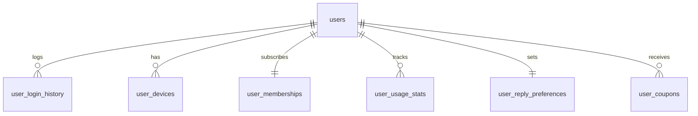
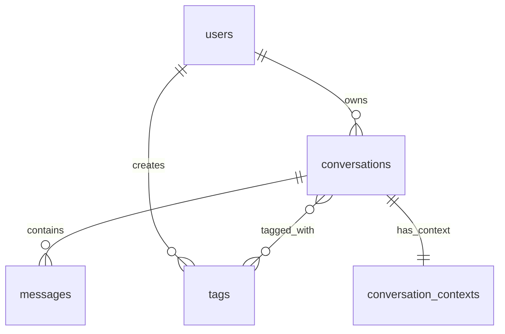
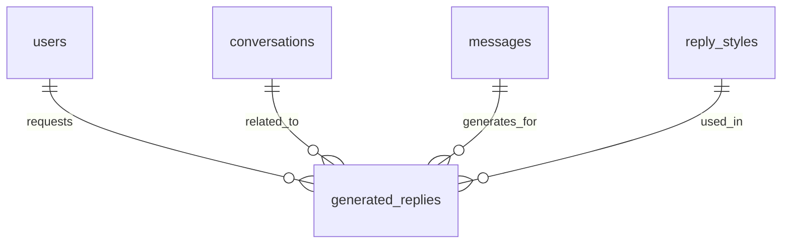
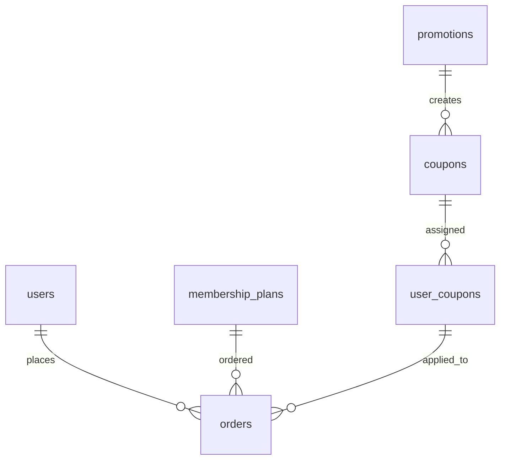

# Dating AI 数据库设计文档

## 1. MongoDB 数据库设计

### 1.1 用户相关集合

#### 1.1.1 用户信息集合 (users)

```json
{
  "_id": "ObjectId",
  "userId": "user123456",
  "openId": "微信用户OpenID", 
  "unionId": "微信开放平台UnionID",
  "nickname": "用户昵称",
  "avatar": "https://example.com/avatars/user123.jpg",
  "gender": "male",  // male, female, unknown
  "age": 28,
  "province": "广东",
  "city": "深圳",
  "occupation": "软件工程师",
  "phone": "13712345678",
  "email": "user@example.com",
  "registrationDate": "2023-05-20T14:30:45Z",
  "lastLoginDate": "2023-06-15T09:20:15Z",
  "userStatus": "active", // active, inactive, banned
  "settings": {
    "notification": true,
    "privacy": "standard", // standard, strict
    "chatHistoryRetention": 30, // 单位：天
    "language": "zh-CN"
  },
  "createdAt": "2023-05-20T14:30:45Z",
  "updatedAt": "2023-06-15T09:20:15Z"
}
```

#### 1.1.2 用户登录历史集合 (user_login_history)

```json
{
  "_id": "ObjectId",
  "userId": "user123456",
  "loginTime": "2023-06-15T09:20:15Z",
  "ipAddress": "192.168.1.1",
  "deviceType": "mobile",
  "deviceId": "device123456",
  "osType": "iOS",
  "osVersion": "16.5",
  "appVersion": "1.0.0",
  "loginMethod": "wechat", // wechat, phone, email, token
  "loginStatus": "success", // success, failed
  "failureReason": null,
  "createdAt": "2023-06-15T09:20:15Z"
}
```

#### 1.1.3 用户设备集合 (user_devices)

```json
{
  "_id": "ObjectId",
  "userId": "user123456",
  "deviceIdentifier": "device123456",
  "deviceName": "iPhone 13 Pro",
  "deviceType": "ios", // ios, android, web, mini_program
  "osVersion": "16.5",
  "appVersion": "1.0.0",
  "pushToken": "push-token-123456",
  "isActive": true,
  "lastActiveTime": "2023-06-15T09:20:15Z",
  "createdAt": "2023-05-20T14:30:45Z", 
  "updatedAt": "2023-06-15T09:20:15Z"
}
```

#### 1.1.4 用户会员集合 (user_memberships)

```json
{
  "_id": "ObjectId",
  "userId": "user123456",
  "planId": "yearly",
  "planName": "年度会员",
  "startTime": "2023-06-16T15:32:10Z",
  "expireTime": "2024-06-16T15:32:10Z",
  "isActive": true,
  "autoRenew": true,
  "originalOrderId": "order123456",
  "nextBillingDate": "2024-06-16T15:32:10Z",
  "nextBillingAmount": 198.00,
  "cancelReason": null,
  "createdAt": "2023-06-16T15:32:10Z",
  "updatedAt": "2023-06-16T15:32:10Z"
}
```

#### 1.1.5 用户使用统计集合 (user_usage_stats)

```json
{
  "_id": "ObjectId",
  "userId": "user123456",
  "date": "2023-06-16",
  "generationCount": 25,
  "copyCount": 12,
  "likeCount": 8,
  "dislikeCount": 3,
  "dailyLimit": 50,
  "usedStyles": [
    {
      "styleId": "casual",
      "count": 10
    },
    {
      "styleId": "romantic",
      "count": 8
    }
  ],
  "createdAt": "2023-06-16T00:00:00Z",
  "updatedAt": "2023-06-16T23:59:59Z"
}
```

#### 1.1.6 用户回复偏好集合 (user_reply_preferences)

```json
{
  "_id": "ObjectId",
  "userId": "user123456",
  "stylePreferences": ["casual", "humorous", "romantic"],
  "lengthPreference": "medium", // short, medium, detailed
  "emotionExpression": "direct", // implicit, direct
  "sampleRatings": [
    {
      "replyId": "reply123456",
      "rating": 4
    }
  ],
  "learningData": {
    "mostCopiedStyles": [
      {"styleId": "romantic", "count": 15},
      {"styleId": "humorous", "count": 12}
    ],
    "mostLikedStyles": [
      {"styleId": "mysterious", "count": 8}
    ],
    "topSuccessfulContexts": [
      {"context": "weekend_plans", "successRate": 0.89},
      {"context": "compliments", "successRate": 0.92}
    ]
  },
  "createdAt": "2023-05-20T14:30:45Z",
  "updatedAt": "2023-06-15T09:20:15Z"
}
```

### 1.2 会话和消息相关集合

#### 1.2.1 会话集合 (conversations)

```json
{
  "_id": "ObjectId",
  "conversationId": "conv123456",
  "userId": "user123456",
  "contactInfo": {
    "name": "张三",
    "avatar": "https://example.com/avatars/zhangsan.jpg",
    "relationship": "friend",
    "platform": "wechat",
    "externalId": "wxid_abc123"
  },
  "tags": ["tag1", "tag3"],
  "isStarred": true,
  "lastMessage": {
    "messageId": "msg123456",
    "content": "明天有空一起吃饭吗？",
    "type": "received",
    "timestamp": "2023-06-15T14:30:45Z"
  },
  "messageCount": 24,
  "unreadCount": 0,
  "status": "active",  // active, archived, deleted
  "createdAt": "2023-05-01T10:00:00Z",
  "updatedAt": "2023-06-15T14:30:45Z",
  "deletedAt": null
}
```

#### 1.2.2 消息集合 (messages)

```json
{
  "_id": "ObjectId",
  "messageId": "msg123456",
  "conversationId": "conv123456",
  "userId": "user123456",
  "type": "received",  // received, generated, sent
  "content": "明天有空一起吃饭吗？",
  "timestamp": "2023-06-15T14:30:45Z",
  "status": "read",   // unread, read, sent, delivered
  "metadata": {
    "platform": "wechat",
    "messageFormat": "text"
  },
  "originalMessageId": null,  // 用于跟踪修改前的生成消息ID
  "style": null,  // 生成消息时的风格
  "analysis": {
    "emotion": "positive",
    "intent": "invitation",
    "topics": ["meeting", "social"],
    "emotionScore": 78
  },
  "isStarred": false,
  "createdAt": "2023-06-15T14:30:45Z",
  "updatedAt": "2023-06-15T14:30:45Z",
  "deletedAt": null
}
```

#### 1.2.3 标签集合 (tags)

```json
{
  "_id": "ObjectId",
  "tagId": "tag123456",
  "userId": "user123456",
  "name": "朋友",
  "color": "#4287f5",
  "sortOrder": 1,
  "count": 12,
  "createdAt": "2023-05-10T11:20:30Z",
  "updatedAt": "2023-06-15T14:30:45Z"
}
```

### 1.3 AI回复生成相关集合

#### 1.3.1 生成回复集合 (generated_replies)

```json
{
  "_id": "ObjectId",
  "requestId": "req123456",
  "userId": "user123456",
  "conversationId": "conv123456",
  "receivedMessageId": "msg123456",
  "replies": [
    {
      "replyId": "reply123456",
      "styleId": "casual",
      "styleName": "随性自然",
      "content": "周末确实有空，一起看电影听起来不错！有什么想看的片子吗？",
      "metadata": {
        "wordCount": 25,
        "emotionalIndex": 70
      },
      "quality": {
        "relevanceScore": 0.92,
        "styleMatchScore": 0.88,
        "totalScore": 0.90
      },
      "userFeedback": {
        "liked": true,
        "copied": true,
        "used": true,
        "feedback": "helpful",
        "feedbackTime": "2023-06-15T14:35:10Z"
      }
    }
  ],
  "generationParams": {
    "model": "gpt-3.5-turbo",
    "temperature": 0.7,
    "styles": ["casual", "humorous", "romantic"],
    "contextTurns": 3
  },
  "analysis": {
    "messageType": "invitation",
    "emotion": "positive",
    "interestLevel": "high",
    "topics": ["weekend", "movie", "date"],
    "suggestedResponseTone": "enthusiastic"
  },
  "performance": {
    "requestTime": 1250,  // 毫秒
    "processingTime": 780,
    "totalTime": 2030
  },
  "createdAt": "2023-06-15T14:32:10Z",
  "updatedAt": "2023-06-15T14:35:10Z"
}
```

#### 1.3.2 回复风格集合 (reply_styles)

```json
{
  "_id": "ObjectId",
  "styleId": "casual",
  "name": "随性自然",
  "description": "轻松自然的对话风格，像老朋友一样交流",
  "longDescription": "随性自然风格模拟日常轻松交流的语言特点，语气亲切，像与熟悉的朋友交谈一样，没有过多修饰，直接而真诚。",
  "tags": ["日常", "轻松", "通用"],
  "isVipOnly": false,
  "category": "基础风格",
  "popularity": 4.8,
  "iconUrl": "https://example.com/styles/casual.png",
  "displayOrder": 1,
  "parameters": {
    "tone": "light-hearted",
    "energy": "medium",
    "formality": "casual",
    "creativity": "medium",
    "emotionExpression": "natural",
    "questionStyle": "open"
  },
  "patternExamples": [
    "使用日常口语表达",
    "保持轻松友好的语气",
    "适当使用简短句式"
  ],
  "avoidPatterns": [
    "过于正式或书面的表达",
    "复杂或学术性的词汇",
    "过长的句子结构"
  ],
  "promptModifiers": "使用自然流畅的对话方式，像与熟悉的朋友交谈一样，语气轻松友好，避免过于正式或复杂的表达",
  "examples": [
    {
      "receivedMessage": "最近工作怎么样？",
      "replyExample": "还行吧，有点忙但能应付。你那边怎么样？"
    },
    {
      "receivedMessage": "周末有什么计划吗？",
      "replyExample": "打算休息一下，可能看看电影。你呢，有安排了吗？"
    }
  ],
  "createdAt": "2023-05-01T10:00:00Z",
  "updatedAt": "2023-05-01T10:00:00Z"
}
```

#### 1.3.3 会话上下文集合 (conversation_contexts)

```json
{
  "_id": "ObjectId",
  "userId": "user123456",
  "conversationId": "conv123456",
  "currentTopic": "movie",
  "currentStage": "developing", // initial, developing, intimate
  "relationshipType": "dating", // dating, friends, acquaintance
  "recentMessages": [
    {
      "messageId": "msg123456",
      "role": "received",
      "content": "你好，周末有空一起去看电影吗？",
      "timestamp": "2023-06-15T14:30:45Z"
    },
    {
      "messageId": "msg123457",
      "role": "sent",
      "content": "周末确实有空，一起看电影听起来不错！有什么想看的片子吗？",
      "timestamp": "2023-06-15T14:35:10Z"
    }
  ],
  "personas": {
    "receiver": {
      "gender": "female",
      "estimatedAge": "20s",
      "communicationStyle": "direct",
      "interestShown": "high"
    }
  },
  "interactionMetrics": {
    "totalExchanges": 24,
    "averageResponseTime": 145,  // 秒
    "topicShiftCount": 5,
    "conversationStartTime": "2023-05-01T10:00:00Z",
    "lastInteractionTime": "2023-06-15T14:35:10Z"
  },
  "createdAt": "2023-05-01T10:00:00Z",
  "updatedAt": "2023-06-15T14:35:10Z"
}
```

### 1.4 支付相关集合

#### 1.4.1 订单集合 (orders)

```json
{
  "_id": "ObjectId",
  "orderId": "order123456",
  "userId": "user123456",
  "planId": "yearly",
  "planName": "年度会员",
  "amount": 198.00,
  "discountAmount": 39.60,
  "finalAmount": 158.40,
  "couponCode": "WELCOME20",
  "promotionId": "newyear2023",
  "paymentMethod": "wechat", // wechat, alipay, apple, google
  "paymentTransactionId": "wx123456789",
  "orderStatus": "paid", // created, paid, failed, expired, refunded
  "autoRenew": true,
  "source": "profile_page",
  "createTime": "2023-06-16T15:30:45Z",
  "paymentTime": "2023-06-16T15:32:10Z",
  "expireTime": "2023-06-16T15:45:45Z",
  "refundTime": null,
  "refundReason": null,
  "createdAt": "2023-06-16T15:30:45Z",
  "updatedAt": "2023-06-16T15:32:10Z"
}
```

#### 1.4.2 会员计划集合 (membership_plans)

```json
{
  "_id": "ObjectId",
  "planId": "yearly",
  "planName": "年度会员",
  "planDescription": "解锁全部高级功能，年度付费，超值优惠",
  "price": 198.00,
  "originalPrice": 298.00,
  "duration": 365,
  "durationType": "day", // day, month, year, lifetime
  "planType": "vip", // free, vip, premium
  "isRecommended": true,
  "isActive": true,
  "features": [
    "无限回复生成",
    "全部回复风格",
    "高级情感分析",
    "优先客服支持",
    "专属新功能抢先体验"
  ],
  "createdAt": "2023-01-01T00:00:00Z",
  "updatedAt": "2023-01-01T00:00:00Z"
}
```

#### 1.4.3 促销活动集合 (promotions)

```json
{
  "_id": "ObjectId",
  "promotionId": "newyear2023",
  "title": "新年特惠",
  "description": "新年限时8折优惠",
  "startTime": "2023-01-01T00:00:00Z",
  "endTime": "2023-01-15T23:59:59Z",
  "discountType": "percentage", // percentage, fixed, free_days
  "discountValue": 20, // 20%
  "applicablePlans": ["monthly", "yearly"],
  "maxUses": 1000,
  "currentUses": 586,
  "isActive": true,
  "createdAt": "2022-12-25T00:00:00Z",
  "updatedAt": "2023-01-10T12:30:45Z"
}
```

#### 1.4.4 优惠券集合 (coupons)

```json
{
  "_id": "ObjectId",
  "couponCode": "WELCOME20",
  "promotionId": "newyear2023",
  "couponType": "percentage", // percentage, fixed, free_days
  "discountValue": 20, // 20%
  "minPurchase": 0,
  "startTime": "2023-01-01T00:00:00Z",
  "endTime": "2023-01-15T23:59:59Z",
  "maxUses": 1,
  "currentUses": 0,
  "isActive": true,
  "applicablePlans": ["monthly", "yearly"],
  "createdAt": "2022-12-25T00:00:00Z",
  "updatedAt": "2022-12-25T00:00:00Z"
}
```

#### 1.4.5 用户优惠券集合 (user_coupons)

```json
{
  "_id": "ObjectId",
  "userId": "user123456",
  "couponCode": "WELCOME20",
  "isUsed": false,
  "usedTime": null,
  "orderId": null,
  "expireTime": "2023-01-15T23:59:59Z",
  "createdAt": "2023-01-05T14:30:45Z",
  "updatedAt": "2023-01-05T14:30:45Z"
}
```

## 2. Milvus 向量数据库设计

### 2.1 回复风格向量集合 (style_embeddings)

```json
{
  "collection_name": "style_embeddings",
  "vector_size": 1536,
  "distance": "Cosine",
  "points": [
    {
      "id": "style_casual",
      "vector": [0.1, 0.2, ...],  // 1536维向量
      "payload": {
        "styleId": "casual",
        "name": "随性自然",
        "category": "基础风格",
        "isVipOnly": false
      }
    }
  ]
}
```

### 2.2 对话语义向量集合 (conversation_embeddings)

```json
{
  "collection_name": "conversation_embeddings",
  "vector_size": 1536,
  "distance": "Cosine",
  "points": [
    {
      "id": "msg123456",
      "vector": [0.1, 0.2, ...],  // 1536维向量
      "payload": {
        "messageId": "msg123456",
        "conversationId": "conv123456",
        "userId": "user123456",
        "content": "明天有空一起吃饭吗？",
        "type": "received",
        "timestamp": "2023-06-15T14:30:45Z",
        "topics": ["invitation", "dining"],
        "emotion": "positive"
      }
    }
  ]
}
```

### 2.3 回复模板向量集合 (reply_templates)

```json
{
  "collection_name": "reply_templates",
  "vector_size": 1536,
  "distance": "Cosine",
  "points": [
    {
      "id": "template123456",
      "vector": [0.1, 0.2, ...],  // 1536维向量
      "payload": {
        "templateId": "template123456",
        "styleId": "casual",
        "content": "周末确实有空，{activity}听起来不错！{question}",
        "context": "invitation",
        "emotionType": "positive",
        "variables": ["activity", "question"],
        "successRate": 0.92
      }
    }
  ]
}
```

### 2.4 用户偏好向量集合 (user_preference_embeddings)

```json
{
  "collection_name": "user_preference_embeddings",
  "vector_size": 1536,
  "distance": "Cosine",
  "points": [
    {
      "id": "user123456",
      "vector": [0.1, 0.2, ...],  // 1536维向量
      "payload": {
        "userId": "user123456",
        "preferredStyles": ["casual", "humorous", "romantic"],
        "communicationPatterns": {
          "questionFrequency": "high",
          "emojiUsage": "moderate",
          "formalityLevel": "casual"
        },
        "updatedAt": "2023-06-15T09:20:15Z"
      }
    }
  ]
}
```

## 3. 数据库索引设计

### 3.1 MongoDB索引

#### 3.1.1 用户相关集合索引

- `users` 集合:
  - `{ userId: 1 }` (主键索引)
  - `{ openId: 1 }` (唯一索引)
  - `{ phone: 1 }` (索引)
  - `{ email: 1 }` (索引)
  - `{ userStatus: 1 }` (索引)

- `user_login_history` 集合:
  - `{ userId: 1, loginTime: -1 }` (复合索引)
  - `{ deviceId: 1 }` (索引)

- `user_devices` 集合:
  - `{ userId: 1, deviceIdentifier: 1 }` (唯一复合索引)
  - `{ deviceIdentifier: 1 }` (索引)
  - `{ isActive: 1 }` (索引)

- `user_memberships` 集合:
  - `{ userId: 1 }` (唯一索引)
  - `{ expireTime: 1 }` (索引, 用于会员到期检查)
  - `{ isActive: 1 }` (索引)

- `user_usage_stats` 集合:
  - `{ userId: 1, date: 1 }` (唯一复合索引)
  - `{ date: 1 }` (索引, 用于统计查询)

- `user_reply_preferences` 集合:
  - `{ userId: 1 }` (唯一索引)

#### 3.1.2 会话和消息相关集合索引

- `conversations` 集合:
  - `{ conversationId: 1 }` (唯一索引)
  - `{ userId: 1, updatedAt: -1 }` (复合索引, 用于列表查询)
  - `{ userId: 1, tags: 1 }` (复合索引, 用于标签筛选)
  - `{ userId: 1, isStarred: 1 }` (复合索引, 用于星标筛选)
  - `{ status: 1 }` (索引)

- `messages` 集合:
  - `{ messageId: 1 }` (唯一索引)
  - `{ conversationId: 1, timestamp: 1 }` (复合索引, 用于时间顺序查询)
  - `{ userId: 1, isStarred: 1 }` (复合索引, 用于星标消息查询)
  - `{ type: 1 }` (索引)
  - `{ content: "text" }` (文本索引, 用于全文搜索)

- `tags` 集合:
  - `{ tagId: 1 }` (唯一索引)
  - `{ userId: 1, name: 1 }` (唯一复合索引)
  - `{ userId: 1, sortOrder: 1 }` (复合索引, 用于排序显示)

#### 3.1.3 AI回复生成相关集合索引

- `generated_replies` 集合:
  - `{ requestId: 1 }` (唯一索引)
  - `{ userId: 1, createdAt: -1 }` (复合索引, 用于历史查询)
  - `{ conversationId: 1, createdAt: -1 }` (复合索引, 用于会话回复查询)

- `reply_styles` 集合:
  - `{ styleId: 1 }` (唯一索引)
  - `{ category: 1, displayOrder: 1 }` (复合索引, 用于分类展示)
  - `{ isVipOnly: 1 }` (索引)
  - `{ popularity: -1 }` (索引, 用于热门排序)

- `conversation_contexts` 集合:
  - `{ userId: 1, conversationId: 1 }` (唯一复合索引)
  - `{ lastInteractionTime: -1 }` (索引, 用于过期清理)

#### 3.1.4 支付相关集合索引

- `orders` 集合:
  - `{ orderId: 1 }` (唯一索引)
  - `{ userId: 1, createTime: -1 }` (复合索引, 用于订单历史查询)
  - `{ orderStatus: 1 }` (索引)
  - `{ paymentTransactionId: 1 }` (索引, 用于支付回调查询)
  - `{ expireTime: 1 }` (索引, 用于过期订单清理)

- `membership_plans` 集合:
  - `{ planId: 1 }` (唯一索引)
  - `{ planType: 1, price: 1 }` (复合索引)
  - `{ isActive: 1 }` (索引)

- `promotions` 集合:
  - `{ promotionId: 1 }` (唯一索引)
  - `{ startTime: 1, endTime: 1 }` (复合索引, 用于时间范围查询)
  - `{ isActive: 1 }` (索引)

- `coupons` 集合:
  - `{ couponCode: 1 }` (唯一索引)
  - `{ promotionId: 1 }` (索引)
  - `{ startTime: 1, endTime: 1 }` (复合索引, 用于时间范围查询)
  - `{ isActive: 1 }` (索引)

- `user_coupons` 集合:
  - `{ userId: 1, couponCode: 1 }` (唯一复合索引)
  - `{ userId: 1, isUsed: 1 }` (复合索引, 用于查询可用优惠券)
  - `{ expireTime: 1 }` (索引, 用于过期清理)

### 3.2 Milvus索引

Milvus作为向量数据库主要基于向量相似度搜索，针对每个集合配置:

- `style_embeddings`: 
  - 创建 `category` 和 `isVipOnly` 的有效载荷索引，用于过滤搜索结果

- `conversation_embeddings`:
  - 创建 `userId`, `conversationId`, `type`, `topics` 和 `emotion` 的有效载荷索引，用于过滤搜索结果

- `reply_templates`:
  - 创建 `styleId`, `context` 和 `emotionType` 的有效载荷索引，用于过滤搜索结果

- `user_preference_embeddings`:
  - 创建 `userId` 和 `preferredStyles` 的有效载荷索引，用于过滤搜索结果

## 4. 数据关系图

### 4.1 用户相关数据关系



### 4.2 会话和消息数据关系



### 4.3 AI回复生成数据关系



### 4.4 支付相关数据关系



## 5. 数据迁移与升级策略

### 5.1 版本控制

- 为每个集合维护一个版本字段 `schemaVersion`
- 每次架构变更时递增版本号
- 在应用启动时检查并执行必要的迁移

### 5.2 迁移策略

1. **小型迁移**：（字段添加、非关键字段修改）
   - 在应用层实现向后兼容，同时逐步更新数据

2. **中型迁移**：（字段重命名、类型变更）
   - 创建迁移脚本，在非高峰期执行
   - 使用双写策略保证数据一致性

3. **大型迁移**：（集合重组、关系变更）
   - 创建新集合，后台同步数据
   - 切换到新集合后，保留旧集合一段时间作为备份

### 5.3 数据备份策略

1. **定时备份**：
   - 每日全量备份
   - 每小时增量备份

2. **地理冗余**：
   - 跨区域备份存储
   - 灾难恢复演练

## 6. 数据安全与隐私

### 6.1 敏感数据处理

1. **数据加密**：
   - 传输加密（HTTPS/TLS）
   - 敏感字段存储加密（如支付信息）
   - 数据库加密

2. **数据脱敏**：
   - 显示时部分遮蔽敏感信息（如手机号、邮箱）
   - 日志中自动脱敏
   - 导出数据时脱敏处理

### 6.2 数据隔离

1. **用户数据隔离**：
   - 严格基于userId过滤所有查询
   - 实现行级访问控制

2. **权限控制**：
   - 基于角色的数据访问控制
   - 最小权限原则
   - 操作审计日志

### 6.3 合规要求

1. **数据保留**：
   - 根据用户设置和法规要求设定数据保留期限
   - 自动化数据清理流程

2. **访问控制**：
   - 管理员访问权限分级
   - 敏感操作多因素认证
   - 访问日志记录与审计