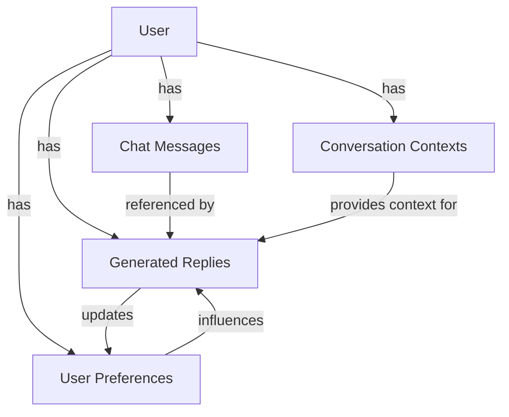
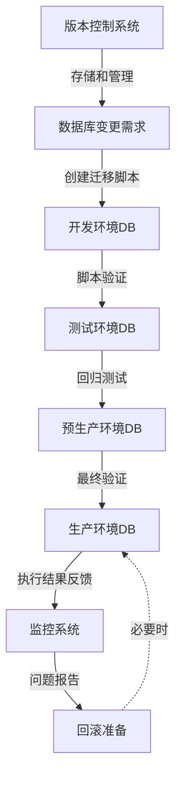

# 语撩应用数据库架构设计

## 1. 数据库概述

「语撩」应用采用多数据库架构，综合使用关系型数据库和NoSQL数据库，以满足不同类型数据和业务场景的需求：

1. **MySQL**：存储用户账户、会员信息、交易记录等结构化数据
2. **MongoDB**：存储聊天记录、生成回复、用户偏好等非结构化或半结构化数据
3. **Redis**：缓存频繁访问的数据，如用户会话、配置信息、使用统计等
4. **Milvus**：向量数据库，用于语义搜索和相似匹配

本文档主要介绍核心业务数据库表的设计和关系。

## 2. 数据库表设计

### 2.1 用户与认证相关表

#### 用户表 (users)

```sql
CREATE TABLE users (
    user_id CHAR(36) PRIMARY KEY,
    openid VARCHAR(64) UNIQUE,
    unionid VARCHAR(64),
    nickname VARCHAR(50),
    avatar_url VARCHAR(255),
    gender VARCHAR(10),
    age INT,
    province VARCHAR(30),
    city VARCHAR(30),
    occupation VARCHAR(50),
    phone VARCHAR(20),
    email VARCHAR(100),
    password_hash VARCHAR(100),  -- 可选，用于非微信登录
    registration_date TIMESTAMP NOT NULL DEFAULT CURRENT_TIMESTAMP,
    last_login_date TIMESTAMP,
    user_status ENUM('active', 'inactive', 'banned') DEFAULT 'active',
    created_at TIMESTAMP NOT NULL DEFAULT CURRENT_TIMESTAMP,
    updated_at TIMESTAMP NOT NULL DEFAULT CURRENT_TIMESTAMP ON UPDATE CURRENT_TIMESTAMP,
    INDEX idx_openid (openid),
    INDEX idx_phone (phone),
    INDEX idx_email (email)
);
```

#### 用户登录历史表 (user_login_history)

```sql
CREATE TABLE user_login_history (
    login_id BIGINT AUTO_INCREMENT PRIMARY KEY,
    user_id CHAR(36) NOT NULL,
    login_time TIMESTAMP NOT NULL DEFAULT CURRENT_TIMESTAMP,
    ip_address VARCHAR(50),
    device_type VARCHAR(20),
    device_id VARCHAR(100),
    os_type VARCHAR(20),
    os_version VARCHAR(20),
    app_version VARCHAR(20),
    login_method ENUM('wechat', 'phone', 'email', 'token') NOT NULL,
    login_status ENUM('success', 'failed'),
    failure_reason VARCHAR(100),
    created_at TIMESTAMP NOT NULL DEFAULT CURRENT_TIMESTAMP,
    INDEX idx_user_id (user_id),
    INDEX idx_login_time (login_time),
    FOREIGN KEY (user_id) REFERENCES users(user_id) ON DELETE CASCADE
);
```

#### 用户设备表 (user_devices)

```sql
CREATE TABLE user_devices (
    device_id BIGINT AUTO_INCREMENT PRIMARY KEY,
    user_id CHAR(36) NOT NULL,
    device_identifier VARCHAR(100) NOT NULL,
    device_name VARCHAR(100),
    device_type ENUM('ios', 'android', 'web', 'mini_program'),
    os_version VARCHAR(20),
    app_version VARCHAR(20),
    push_token VARCHAR(255),
    is_active BOOLEAN DEFAULT TRUE,
    last_active_time TIMESTAMP,
    created_at TIMESTAMP NOT NULL DEFAULT CURRENT_TIMESTAMP,
    updated_at TIMESTAMP NOT NULL DEFAULT CURRENT_TIMESTAMP ON UPDATE CURRENT_TIMESTAMP,
    UNIQUE KEY idx_user_device (user_id, device_identifier),
    INDEX idx_device_identifier (device_identifier),
    FOREIGN KEY (user_id) REFERENCES users(user_id) ON DELETE CASCADE
);
```

#### 用户设置表 (user_settings)

```sql
CREATE TABLE user_settings (
    setting_id BIGINT AUTO_INCREMENT PRIMARY KEY,
    user_id CHAR(36) NOT NULL UNIQUE,
    notification_enabled BOOLEAN DEFAULT TRUE,
    privacy_level ENUM('standard', 'strict') DEFAULT 'standard',
    chat_history_retention INT DEFAULT 30,  -- 保存天数
    language VARCHAR(10) DEFAULT 'zh-CN',
    theme ENUM('light', 'dark', 'auto') DEFAULT 'auto',
    create_time TIMESTAMP NOT NULL DEFAULT CURRENT_TIMESTAMP,
    update_time TIMESTAMP NOT NULL DEFAULT CURRENT_TIMESTAMP ON UPDATE CURRENT_TIMESTAMP,
    FOREIGN KEY (user_id) REFERENCES users(user_id) ON DELETE CASCADE
);
```

### 2.2 约会偏好相关表

#### 用户约会偏好表 (user_dating_preferences)

```sql
CREATE TABLE user_dating_preferences (
    preference_id BIGINT AUTO_INCREMENT PRIMARY KEY,
    user_id CHAR(36) NOT NULL UNIQUE,
    gender_preference ENUM('male', 'female', 'any') DEFAULT 'any',
    min_age INT,
    max_age INT,
    relationship_status ENUM('single', 'married', 'complicated') DEFAULT 'single',
    dating_purpose JSON,  -- ["serious", "friends", "social", "marriage"]
    created_at TIMESTAMP NOT NULL DEFAULT CURRENT_TIMESTAMP,
    updated_at TIMESTAMP NOT NULL DEFAULT CURRENT_TIMESTAMP ON UPDATE CURRENT_TIMESTAMP,
    FOREIGN KEY (user_id) REFERENCES users(user_id) ON DELETE CASCADE
);
```

#### 用户回复偏好表 (user_reply_preferences)

```sql
CREATE TABLE user_reply_preferences (
    preference_id BIGINT AUTO_INCREMENT PRIMARY KEY,
    user_id CHAR(36) NOT NULL UNIQUE,
    style_preference JSON,  -- ["humorous", "romantic", "mysterious"]
    length_preference ENUM('short', 'medium', 'detailed') DEFAULT 'medium',
    emotion_expression ENUM('implicit', 'direct') DEFAULT 'direct',
    sample_ratings JSON,  -- [{"replyId": "xxx", "rating": 4}]
    created_at TIMESTAMP NOT NULL DEFAULT CURRENT_TIMESTAMP,
    updated_at TIMESTAMP NOT NULL DEFAULT CURRENT_TIMESTAMP ON UPDATE CURRENT_TIMESTAMP,
    FOREIGN KEY (user_id) REFERENCES users(user_id) ON DELETE CASCADE
);
```

### 2.3 会员与支付相关表

#### 会员计划表 (membership_plans)

```sql
CREATE TABLE membership_plans (
    plan_id VARCHAR(36) PRIMARY KEY,
    plan_name VARCHAR(50) NOT NULL,
    plan_description TEXT,
    price DECIMAL(10,2) NOT NULL,
    original_price DECIMAL(10,2),
    duration INT NOT NULL,  -- 单位：天
    duration_type ENUM('day', 'month', 'year', 'lifetime') DEFAULT 'month',
    plan_type ENUM('free', 'vip', 'premium') NOT NULL,
    is_recommended BOOLEAN DEFAULT FALSE,
    is_active BOOLEAN DEFAULT TRUE,
    features JSON,  -- 功能列表
    created_at TIMESTAMP NOT NULL DEFAULT CURRENT_TIMESTAMP,
    updated_at TIMESTAMP NOT NULL DEFAULT CURRENT_TIMESTAMP ON UPDATE CURRENT_TIMESTAMP
);
```

#### 用户会员表 (user_memberships)

```sql
CREATE TABLE user_memberships (
    membership_id BIGINT AUTO_INCREMENT PRIMARY KEY,
    user_id CHAR(36) NOT NULL,
    plan_id VARCHAR(36) NOT NULL,
    start_time TIMESTAMP NOT NULL,
    expire_time TIMESTAMP NOT NULL,
    is_active BOOLEAN DEFAULT TRUE,
    auto_renew BOOLEAN DEFAULT FALSE,
    original_order_id VARCHAR(36),
    next_billing_date TIMESTAMP,
    next_billing_amount DECIMAL(10,2),
    cancel_reason VARCHAR(100),
    created_at TIMESTAMP NOT NULL DEFAULT CURRENT_TIMESTAMP,
    updated_at TIMESTAMP NOT NULL DEFAULT CURRENT_TIMESTAMP ON UPDATE CURRENT_TIMESTAMP,
    UNIQUE KEY idx_user_active (user_id, is_active),
    INDEX idx_expire_time (expire_time),
    FOREIGN KEY (user_id) REFERENCES users(user_id) ON DELETE CASCADE,
    FOREIGN KEY (plan_id) REFERENCES membership_plans(plan_id)
);
```

#### 订单表 (orders)

```sql
CREATE TABLE orders (
    order_id VARCHAR(36) PRIMARY KEY,
    user_id CHAR(36) NOT NULL,
    plan_id VARCHAR(36) NOT NULL,
    amount DECIMAL(10,2) NOT NULL,
    discount_amount DECIMAL(10,2) DEFAULT 0,
    final_amount DECIMAL(10,2) NOT NULL,
    coupon_code VARCHAR(32),
    promotion_id VARCHAR(32),
    payment_method ENUM('wechat', 'alipay', 'apple', 'google') NOT NULL,
    payment_transaction_id VARCHAR(100),
    order_status ENUM('created', 'paid', 'failed', 'expired', 'refunded') NOT NULL,
    auto_renew BOOLEAN DEFAULT FALSE,
    source VARCHAR(50),  -- 购买来源
    create_time TIMESTAMP NOT NULL DEFAULT CURRENT_TIMESTAMP,
    payment_time TIMESTAMP,
    expire_time TIMESTAMP,
    refund_time TIMESTAMP,
    refund_reason VARCHAR(200),
    created_at TIMESTAMP NOT NULL DEFAULT CURRENT_TIMESTAMP,
    updated_at TIMESTAMP NOT NULL DEFAULT CURRENT_TIMESTAMP ON UPDATE CURRENT_TIMESTAMP,
    INDEX idx_user_id (user_id),
    INDEX idx_order_status (order_status),
    INDEX idx_create_time (create_time),
    FOREIGN KEY (user_id) REFERENCES users(user_id) ON DELETE CASCADE,
    FOREIGN KEY (plan_id) REFERENCES membership_plans(plan_id)
);
```

#### 促销活动表 (promotions)

```sql
CREATE TABLE promotions (
    promotion_id VARCHAR(32) PRIMARY KEY,
    title VARCHAR(100) NOT NULL,
    description TEXT,
    start_time TIMESTAMP NOT NULL,
    end_time TIMESTAMP NOT NULL,
    discount_type ENUM('percentage', 'fixed', 'free_days') NOT NULL,
    discount_value DECIMAL(10,2) NOT NULL,
    applicable_plans JSON,  -- ["plan_id1", "plan_id2"]
    max_uses INT,
    current_uses INT DEFAULT 0,
    is_active BOOLEAN DEFAULT TRUE,
    created_at TIMESTAMP NOT NULL DEFAULT CURRENT_TIMESTAMP,
    updated_at TIMESTAMP NOT NULL DEFAULT CURRENT_TIMESTAMP ON UPDATE CURRENT_TIMESTAMP,
    INDEX idx_time_range (start_time, end_time),
    INDEX idx_is_active (is_active)
);
```

#### 优惠券表 (coupons)

```sql
CREATE TABLE coupons (
    coupon_code VARCHAR(32) PRIMARY KEY,
    promotion_id VARCHAR(32),
    coupon_type ENUM('percentage', 'fixed', 'free_days') NOT NULL,
    discount_value DECIMAL(10,2) NOT NULL,
    min_purchase DECIMAL(10,2) DEFAULT 0,
    start_time TIMESTAMP NOT NULL,
    end_time TIMESTAMP NOT NULL,
    max_uses INT,
    current_uses INT DEFAULT 0,
    is_active BOOLEAN DEFAULT TRUE,
    applicable_plans JSON,  -- ["plan_id1", "plan_id2"]
    created_at TIMESTAMP NOT NULL DEFAULT CURRENT_TIMESTAMP,
    updated_at TIMESTAMP NOT NULL DEFAULT CURRENT_TIMESTAMP ON UPDATE CURRENT_TIMESTAMP,
    INDEX idx_promotion_id (promotion_id),
    INDEX idx_time_range (start_time, end_time),
    INDEX idx_is_active (is_active),
    FOREIGN KEY (promotion_id) REFERENCES promotions(promotion_id) ON DELETE SET NULL
);
```

#### 用户优惠券表 (user_coupons)

```sql
CREATE TABLE user_coupons (
    id BIGINT AUTO_INCREMENT PRIMARY KEY,
    user_id CHAR(36) NOT NULL,
    coupon_code VARCHAR(32) NOT NULL,
    is_used BOOLEAN DEFAULT FALSE,
    used_time TIMESTAMP,
    order_id VARCHAR(36),
    expire_time TIMESTAMP NOT NULL,
    created_at TIMESTAMP NOT NULL DEFAULT CURRENT_TIMESTAMP,
    updated_at TIMESTAMP NOT NULL DEFAULT CURRENT_TIMESTAMP ON UPDATE CURRENT_TIMESTAMP,
    UNIQUE KEY idx_user_coupon (user_id, coupon_code),
    INDEX idx_expire_time (expire_time),
    FOREIGN KEY (user_id) REFERENCES users(user_id) ON DELETE CASCADE,
    FOREIGN KEY (coupon_code) REFERENCES coupons(coupon_code) ON DELETE CASCADE,
    FOREIGN KEY (order_id) REFERENCES orders(order_id) ON DELETE SET NULL
);
```

### 2.4 回复风格相关表

#### 回复风格表 (reply_styles)

```sql
CREATE TABLE reply_styles (
    style_id VARCHAR(32) PRIMARY KEY,
    name VARCHAR(50) NOT NULL,
    description VARCHAR(200) NOT NULL,
    long_description TEXT,
    tags JSON,  -- ["casual", "social", "dating"]
    is_vip_only BOOLEAN DEFAULT FALSE,
    category VARCHAR(30),
    popularity DECIMAL(3,1) DEFAULT 0,
    icon_url VARCHAR(200),
    display_order INT DEFAULT 0,
    created_at TIMESTAMP NOT NULL DEFAULT CURRENT_TIMESTAMP,
    updated_at TIMESTAMP NOT NULL DEFAULT CURRENT_TIMESTAMP ON UPDATE CURRENT_TIMESTAMP,
    INDEX idx_is_vip_only (is_vip_only),
    INDEX idx_category (category),
    INDEX idx_display_order (display_order)
);
```

#### 风格示例表 (style_examples)

```sql
CREATE TABLE style_examples (
    example_id VARCHAR(32) PRIMARY KEY,
    style_id VARCHAR(32) NOT NULL,
    received_message TEXT NOT NULL,
    reply_example TEXT NOT NULL,
    context VARCHAR(100),
    is_vip_only BOOLEAN DEFAULT FALSE,
    display_order INT DEFAULT 0,
    created_at TIMESTAMP NOT NULL DEFAULT CURRENT_TIMESTAMP,
    updated_at TIMESTAMP NOT NULL DEFAULT CURRENT_TIMESTAMP ON UPDATE CURRENT_TIMESTAMP,
    INDEX idx_style_id (style_id),
    INDEX idx_display_order (display_order),
    FOREIGN KEY (style_id) REFERENCES reply_styles(style_id) ON DELETE CASCADE
);
```

#### 用户收藏风格表 (user_favorite_styles)

```sql
CREATE TABLE user_favorite_styles (
    id BIGINT AUTO_INCREMENT PRIMARY KEY,
    user_id CHAR(36) NOT NULL,
    style_id VARCHAR(32) NOT NULL,
    created_at TIMESTAMP NOT NULL DEFAULT CURRENT_TIMESTAMP,
    UNIQUE KEY idx_user_style (user_id, style_id),
    FOREIGN KEY (user_id) REFERENCES users(user_id) ON DELETE CASCADE,
    FOREIGN KEY (style_id) REFERENCES reply_styles(style_id) ON DELETE CASCADE
);
```

#### 用户风格使用表 (user_style_usage)

```sql
CREATE TABLE user_style_usage (
    id BIGINT AUTO_INCREMENT PRIMARY KEY,
    user_id CHAR(36) NOT NULL,
    style_id VARCHAR(32) NOT NULL,
    usage_count INT DEFAULT 0,
    last_used_at TIMESTAMP,
    created_at TIMESTAMP NOT NULL DEFAULT CURRENT_TIMESTAMP,
    updated_at TIMESTAMP NOT NULL DEFAULT CURRENT_TIMESTAMP ON UPDATE CURRENT_TIMESTAMP,
    UNIQUE KEY idx_user_style (user_id, style_id),
    INDEX idx_usage_count (usage_count),
    FOREIGN KEY (user_id) REFERENCES users(user_id) ON DELETE CASCADE,
    FOREIGN KEY (style_id) REFERENCES reply_styles(style_id) ON DELETE CASCADE
);
```

### 2.5 AI生成与使用统计相关表

#### 用户使用统计表 (user_usage_stats)

```sql
CREATE TABLE user_usage_stats (
    id BIGINT AUTO_INCREMENT PRIMARY KEY,
    user_id CHAR(36) NOT NULL,
    date DATE NOT NULL,
    generation_count INT DEFAULT 0,
    copy_count INT DEFAULT 0,
    like_count INT DEFAULT 0,
    dislike_count INT DEFAULT 0,
    daily_limit INT DEFAULT 20,
    created_at TIMESTAMP NOT NULL DEFAULT CURRENT_TIMESTAMP,
    updated_at TIMESTAMP NOT NULL DEFAULT CURRENT_TIMESTAMP ON UPDATE CURRENT_TIMESTAMP,
    UNIQUE KEY idx_user_date (user_id, date),
    FOREIGN KEY (user_id) REFERENCES users(user_id) ON DELETE CASCADE
);
```

### 2.6 MongoDB集合设计

#### 聊天消息集合 (Chat Messages)

```json
{
  "_id": "ObjectId",
  "userId": "用户ID",
  "messageType": "received",  // received/generated
  "content": "消息内容",
  "receivedFrom": {
    "name": "对方名称",
    "avatar": "头像URL",
    "gender": "性别"
  },
  "metadata": {
    "platform": "微信/QQ/其他",
    "messageFormat": "text/image/voice", 
    "sentTime": "ISODate"
  },
  "analysis": {
    "emotion": "positive/neutral/negative",
    "intensity": 0.85,
    "topics": ["旅行", "音乐"],
    "intent": "question/statement/invitation",
    "interestLevel": "high/medium/low"
  },
  "createdAt": "ISODate",
  "updatedAt": "ISODate"
}
```

#### 生成回复集合 (Generated Replies)

```json
{
  "_id": "ObjectId",
  "userId": "用户ID",
  "requestId": "生成请求ID",
  "receivedMessageId": "收到消息ID",
  "replies": [
    {
      "replyId": "回复ID",
      "styleId": "风格ID",
      "content": "生成的回复内容",
      "metadata": {
        "wordCount": 35,
        "emotionalIndex": 78,
        "interestLevel": "high"
      },
      "quality": {
        "relevanceScore": 0.92,
        "styleMatchScore": 0.85,
        "fluencyScore": 0.90,
        "totalScore": 0.88
      },
      "userFeedback": {
        "liked": true,
        "copied": true,
        "feedback": "helpful/not_helpful",
        "feedbackTime": "ISODate"
      }
    }
  ],
  "generationParams": {
    "model": "gpt-3.5-turbo/gpt-4",
    "temperature": 0.7,
    "styles": ["romantic", "casual"],
    "contextTurns": 3
  },
  "performance": {
    "requestTime": 1250,  // 毫秒
    "processingTime": 780,
    "totalTime": 2030
  },
  "createdAt": "ISODate",
  "updatedAt": "ISODate"
}
```

#### 用户偏好集合 (User Preferences)

```json
{
  "_id": "ObjectId",
  "userId": "用户ID",
  "preferredStyles": ["humorous", "romantic", "mysterious"],
  "avoidedStyles": ["formal", "poetic"],
  "responseLength": "medium",
  "topicPreferences": {
    "favoriteTopic": ["travel", "music", "food"],
    "avoidedTopic": ["politics", "religion"]
  },
  "communicationPatterns": {
    "questionFrequency": "high",
    "emojiUsage": "moderate",
    "formalityLevel": "casual"
  },
  "learningData": {
    "mostCopiedStyles": [
      {"styleId": "romantic", "count": 15},
      {"styleId": "humorous", "count": 12}
    ],
    "mostLikedStyles": [
      {"styleId": "mysterious", "count": 8}
    ],
    "topSuccessfulContexts": [
      {"context": "weekend_plans", "successRate": 0.89},
      {"context": "compliments", "successRate": 0.92}
    ]
  },
  "createdAt": "ISODate",
  "updatedAt": "ISODate"
}
```

#### 会话上下文集合 (Conversation Contexts)

```json
{
  "_id": "ObjectId",
  "userId": "用户ID",
  "conversationId": "会话ID",
  "currentTopic": "当前话题",
  "currentStage": "initial/developing/intimate",
  "relationshipType": "dating/friends/acquaintance",
  "recentMessages": [
    {
      "messageId": "消息ID",
      "role": "user/other",
      "content": "消息内容",
      "timestamp": "ISODate"
    }
  ],
  "personas": {
    "receiver": {
      "gender": "female/male",
      "estimatedAge": "20s",
      "communicationStyle": "direct/playful/reserved",
      "interestShown": "high/medium/low"
    }
  },
  "interactionMetrics": {
    "totalExchanges": 24,
    "averageResponseTime": 145,  // 秒
    "topicShiftCount": 5,
    "conversationStartTime": "ISODate",
    "lastInteractionTime": "ISODate"
  },
  "createdAt": "ISODate",
  "updatedAt": "ISODate"
}
```

## 3. 数据库架构图

### 3.1 关系型数据库ER图

```mermaid
erDiagram
    users ||--o{ user_login_history : "logs"
    users ||--o{ user_devices : "has"
    users ||--|| user_settings : "configures"
    users ||--|| user_dating_preferences : "sets"
    users ||--|| user_reply_preferences : "sets"
    users ||--o{ user_memberships : "subscribes"
    users ||--o{ orders : "places"
    users ||--o{ user_coupons : "receives"
    users ||--o{ user_favorite_styles : "saves"
    users ||--o{ user_style_usage : "uses"
    users ||--o{ user_usage_stats : "tracks"
    
    membership_plans ||--o{ user_memberships : "defines"
    membership_plans ||--o{ orders : "ordered"
    
    promotions ||--o{ coupons : "creates"
    coupons ||--o{ user_coupons : "assigned"
    user_coupons ||--o{ orders : "applied_to"
    
    reply_styles ||--o{ style_examples : "contains"
    reply_styles ||--o{ user_favorite_styles : "favorited"
    reply_styles ||--o{ user_style_usage : "used"
    
    users {
        user_id CHAR(36) PK
        openid VARCHAR(64)
        nickname VARCHAR(50)
        avatar_url VARCHAR(255)
        gender VARCHAR(10)
        phone VARCHAR(20)
        email VARCHAR(100)
        user_status ENUM
    }
    
    user_settings {
        setting_id BIGINT PK
        user_id CHAR(36) FK
        notification_enabled BOOLEAN
        privacy_level ENUM
        chat_history_retention INT
    }
    
    user_memberships {
        membership_id BIGINT PK
        user_id CHAR(36) FK
        plan_id VARCHAR(36) FK
        start_time TIMESTAMP
        expire_time TIMESTAMP
        is_active BOOLEAN
        auto_renew BOOLEAN
    }
    
    membership_plans {
        plan_id VARCHAR(36) PK
        plan_name VARCHAR(50)
        price DECIMAL(10,2)
        duration INT
        plan_type ENUM
        is_active BOOLEAN
    }
    
    orders {
        order_id VARCHAR(36) PK
        user_id CHAR(36) FK
        plan_id VARCHAR(36) FK
        amount DECIMAL(10,2)
        payment_method ENUM
        order_status ENUM
    }
    
    reply_styles {
        style_id VARCHAR(32) PK
        name VARCHAR(50)
        description VARCHAR(200)
        is_vip_only BOOLEAN
        popularity DECIMAL(3,1)
    }
    
    user_favorite_styles {
        id BIGINT PK
        user_id CHAR(36) FK
        style_id VARCHAR(32) FK
    }
```

### 3.2 NoSQL数据库概念图



## 4. 数据字典

### 4.1 核心表字段说明

#### 用户表 (users)

| 字段名 | 数据类型 | 允许空 | 默认值 | 说明 |
|-------|---------|-------|-------|------|
| user_id | CHAR(36) | 否 | - | 主键，UUID格式 |
| openid | VARCHAR(64) | 是 | NULL | 微信用户唯一标识 |
| unionid | VARCHAR(64) | 是 | NULL | 微信开放平台唯一标识 |
| nickname | VARCHAR(50) | 是 | NULL | 用户昵称 |
| avatar_url | VARCHAR(255) | 是 | NULL | 头像URL |
| gender | VARCHAR(10) | 是 | NULL | 性别 |
| age | INT | 是 | NULL | 年龄 |
| province | VARCHAR(30) | 是 | NULL | 省份 |
| city | VARCHAR(30) | 是 | NULL | 城市 |
| occupation | VARCHAR(50) | 是 | NULL | 职业 |
| phone | VARCHAR(20) | 是 | NULL | 手机号码 |
| email | VARCHAR(100) | 是 | NULL | 邮箱 |
| password_hash | VARCHAR(100) | 是 | NULL | 密码哈希值（非微信登录使用） |
| registration_date | TIMESTAMP | 否 | CURRENT_TIMESTAMP | 注册日期 |
| last_login_date | TIMESTAMP | 是 | NULL | 最后登录日期 |
| user_status | ENUM | 否 | 'active' | 用户状态：active/inactive/banned |

#### 会员计划表 (membership_plans)

| 字段名 | 数据类型 | 允许空 | 默认值 | 说明 |
|-------|---------|-------|-------|------|
| plan_id | VARCHAR(36) | 否 | - | 主键，会员计划ID |
| plan_name | VARCHAR(50) | 否 | - | 计划名称 |
| plan_description | TEXT | 是 | NULL | 计划详细描述 |
| price | DECIMAL(10,2) | 否 | - | 价格 |
| original_price | DECIMAL(10,2) | 是 | NULL | 原价，用于显示折扣 |
| duration | INT | 否 | - | 有效期天数 |
| duration_type | ENUM | 否 | 'month' | 时长类型：day/month/year/lifetime |
| plan_type | ENUM | 否 | - | 计划类型：free/vip/premium |
| is_recommended | BOOLEAN | 否 | FALSE | 是否推荐计划 |
| is_active | BOOLEAN | 否 | TRUE | 是否有效 |
| features | JSON | 是 | NULL | 功能列表，JSON格式 |

#### 回复风格表 (reply_styles)

| 字段名 | 数据类型 | 允许空 | 默认值 | 说明 |
|-------|---------|-------|-------|------|
| style_id | VARCHAR(32) | 否 | - | 主键，风格ID |
| name | VARCHAR(50) | 否 | - | 风格名称 |
| description | VARCHAR(200) | 否 | - | 简短描述 |
| long_description | TEXT | 是 | NULL | 详细描述 |
| tags | JSON | 是 | NULL | 标签列表，如["casual", "social"] |
| is_vip_only | BOOLEAN | 否 | FALSE | 是否仅VIP可用 |
| category | VARCHAR(30) | 是 | NULL | 风格分类 |
| popularity | DECIMAL(3,1) | 否 | 0 | 受欢迎度评分(0-5) |
| icon_url | VARCHAR(200) | 是 | NULL | 图标URL |
| display_order | INT | 否 | 0 | 显示顺序 |

## 5. 数据访问策略

### 5.1 性能优化

1. **索引策略**：
   - 为频繁查询的字段创建索引，如user_id, order_status等
   - 为范围查询创建复合索引，如(start_time, end_time)
   - 避免过度索引，优先考虑高频查询

2. **分区策略**：
   - 大表采用时间分区，如按月分区用户使用统计表
   - 考虑按用户ID范围分区大型业务表

3. **缓存策略**：
   - 使用Redis缓存用户会话和权限信息
   - 缓存不频繁变更的配置数据，如回复风格定义
   - 实现多级缓存，最近访问数据保持在内存中

### 5.2 安全性考虑

1. **数据加密**：
   - 敏感信息字段使用加密存储，如支付信息
   - 传输过程使用HTTPS/TLS加密
   - 实施不同级别的数据脱敏策略

2. **访问控制**：
   - 实施基于角色的访问控制(RBAC)
   - 细粒度的数据访问权限设计
   - 所有数据库操作记录审计日志

3. **数据备份**：
   - 实施定期数据备份策略
   - 构建多区域灾备解决方案
   - 定期测试数据恢复流程

### 5.3 扩展性考虑

1. **读写分离**：
   - 实施主从架构，提升读取性能
   - 针对高频读业务部署只读副本

2. **分库分表**：
   - 为用户数据和交易数据准备水平分片方案
   - 使用一致性哈希算法执行分片

3. **数据归档**：
   - 定期将历史数据归档至低成本存储
   - 实施数据生命周期管理策略
   - 保留必要的查询接口访问历史数据

## 6. 数据迁移与版本管理

### 6.1 迁移策略

1. **版本化数据库变更**：
   - 使用Flyway或Liquibase管理数据库版本
   - 所有数据库变更通过迁移脚本执行
   - 维护向前和向后兼容的迁移路径

2. **无停机迁移**：
   - 实现无停机数据库架构升级方案
   - 大型变更分步执行，减少风险
   - 使用双写策略确保数据一致性

### 6.2 数据库版本管理流程



## 7. 未来扩展计划

### 7.1 短期扩展（1-3个月）

1. **优化现有索引结构**，基于实际查询模式
2. **实施读写分离**，提升高峰期性能
3. **改进数据缓存策略**，减轻数据库负载

### 7.2 中期扩展（3-6个月）

1. **实施时序数据存储**，优化用户行为分析
2. **引入图数据库**，支持社交网络和推荐功能
3. **建立数据湖架构**，支持高级分析和AI训练

### 7.3 长期规划（6-12个月）

1. **微服务数据架构**，支持业务领域独立扩展
2. **全球多区域部署**，减少访问延迟
3. **实时数据处理管道**，支持即时分析和个性化 