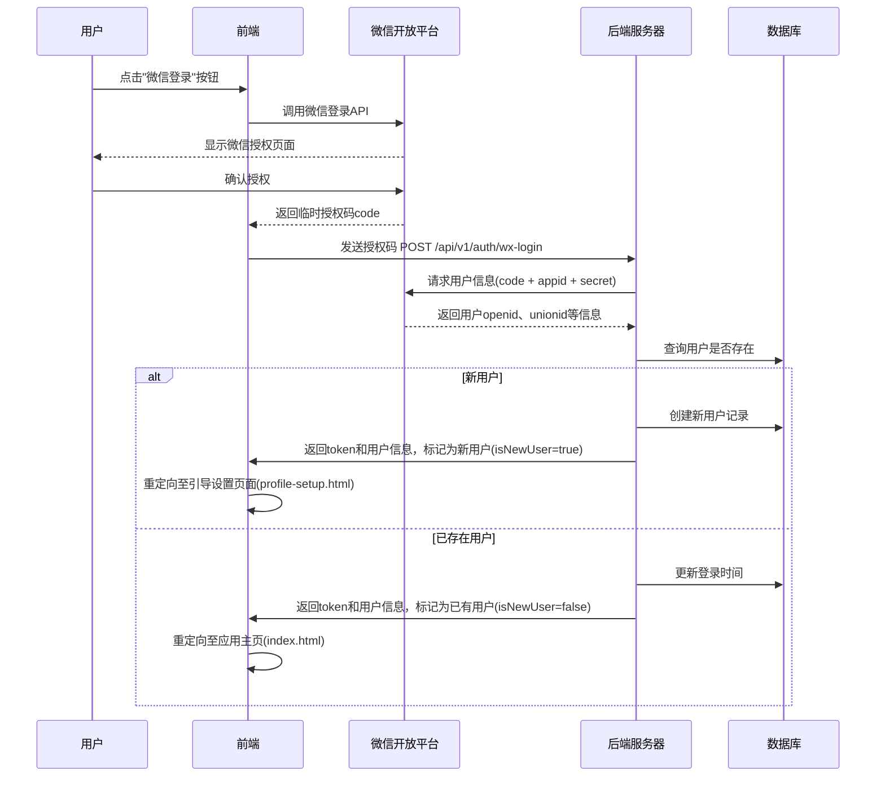

# 登录页面交互逻辑

## 1. 页面概述

登录页面是用户进入「语撩」应用的入口，采用简洁的单一登录方式设计，专注于微信登录，简化用户的注册/登录流程。

## 2. 前端组件

- 品牌展示区域（Logo + 应用名称 + 副标题）
- 微信登录按钮
- 用户协议与隐私政策链接
- 背景设计元素

## 3. 前后端交互流程

### 3.1 微信登录流程



### 3.2 API接口设计

#### 微信登录接口

**请求：**
```
POST /api/v1/auth/wx-login
Content-Type: application/json

{
  "code": "微信授权返回的临时code",
  "deviceId": "设备唯一标识"
}
```

**响应：**
```json
{
  "code": "000000",
  "msg": "成功",
  "data": {
    "token": "JWT认证令牌",
    "refreshToken": "刷新令牌",
    "userId": "用户ID",
    "nickname": "用户昵称",
    "avatar": "头像URL",
    "isNewUser": true,  // 是否新用户
    "vipInfo": {
      "isVip": false,
      "expireTime": null,
      "level": 0  // 0-免费用户 1-VIP会员 2-至尊会员
    }
  }
}
```

### 3.3 本地数据存储

登录成功后，前端需要在本地存储以下信息：

```javascript
// 存储用户令牌
localStorage.setItem('ylToken', response.data.token);
localStorage.setItem('ylRefreshToken', response.data.refreshToken);

// 存储基本用户信息
localStorage.setItem('ylUserInfo', JSON.stringify({
  userId: response.data.userId,
  nickname: response.data.nickname,
  avatar: response.data.avatar,
  isVip: response.data.vipInfo.isVip,
  vipLevel: response.data.vipInfo.level,
  vipExpireTime: response.data.vipInfo.expireTime
}));
```

## 4. 安全考虑

1. **HTTPS加密** - 确保所有API通信通过HTTPS进行
2. **Token管理** - 实现令牌过期刷新机制，定期刷新用户登录状态
3. **防刷策略** - 对登录接口实施频率限制，防止恶意调用
4. **敏感信息处理** - 不在前端存储任何敏感用户数据

## 5. 错误处理

| 错误码 | 错误描述 | 前端处理 |
|-------|---------|---------|
| 000400 | 参数错误 | 显示"登录参数错误，请重试" |
| 000401 | 微信授权失败 | 显示"微信授权失败，请重新授权" |
| 000500 | 服务器错误 | 显示"服务器繁忙，请稍后再试" |

## 6. 营销策略

1. **首次登录优惠** - 新用户首次登录后，在引导设置完成时，展示"新用户专享7天VIP"的弹窗
2. **登录奖励** - 连续登录奖励机制，每天登录增加免费使用次数
3. **裂变策略** - 提供"邀请好友得VIP天数"的按钮，增加用户分享动力

## 7. 数据分析追踪

需要在登录页面集成以下数据埋点：

1. 页面访问量(PV)
2. 登录按钮点击率
3. 登录成功率
4. 登录来源渠道
5. 新用户与老用户比例

## 8. A/B测试计划

可以对登录页面进行以下A/B测试：

1. 不同的背景设计
2. 不同的营销文案
3. 登录按钮的颜色与位置
4. 展示/不展示用户数量信息的效果对比 