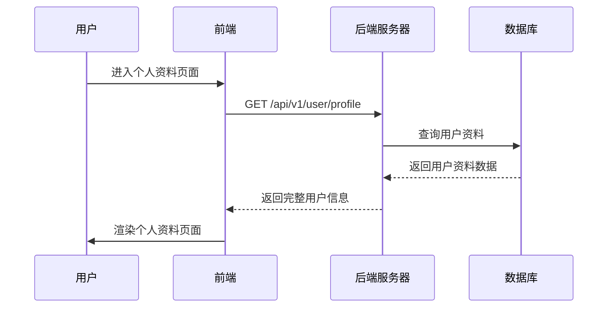
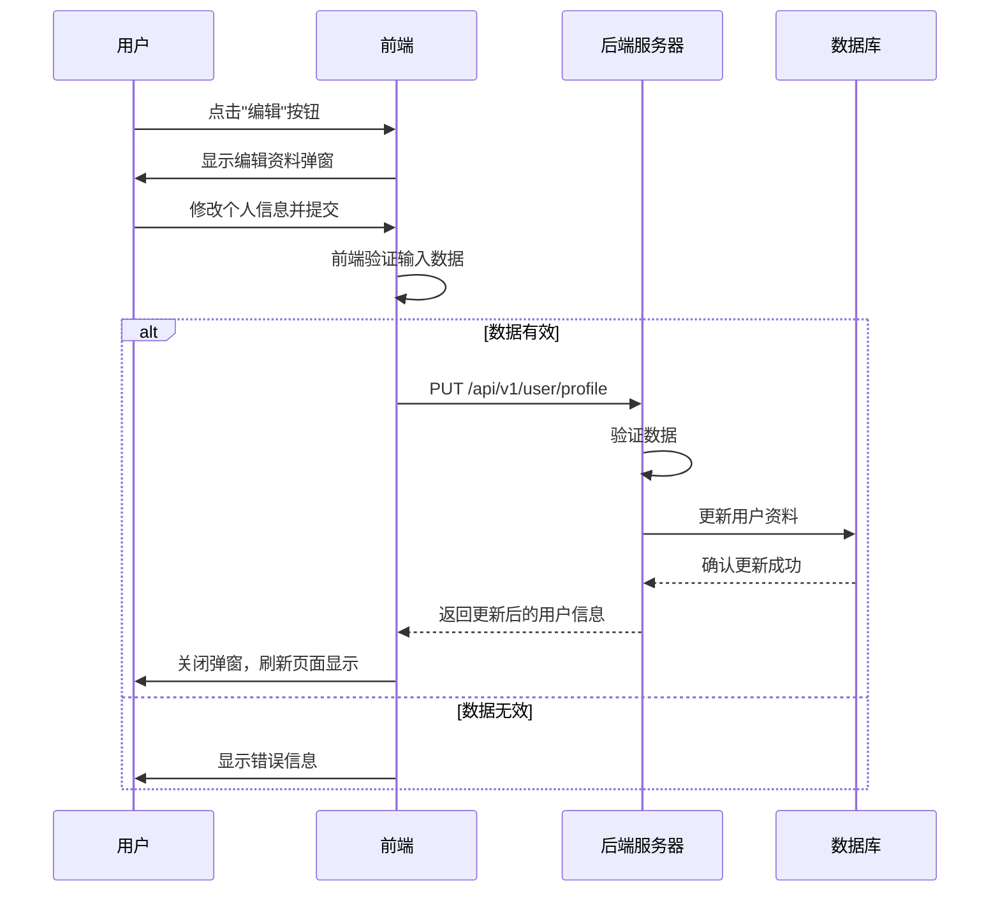
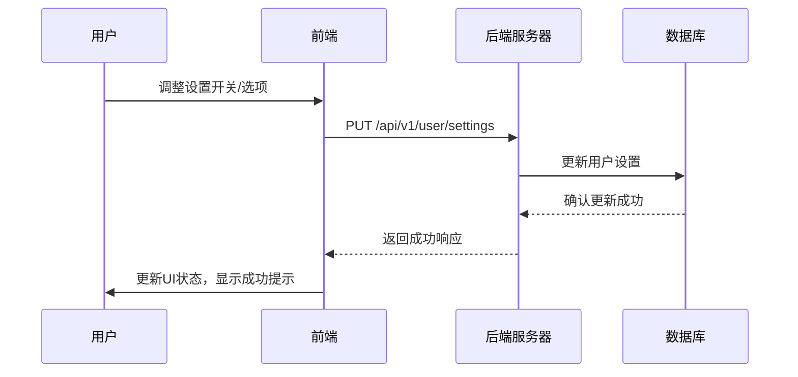
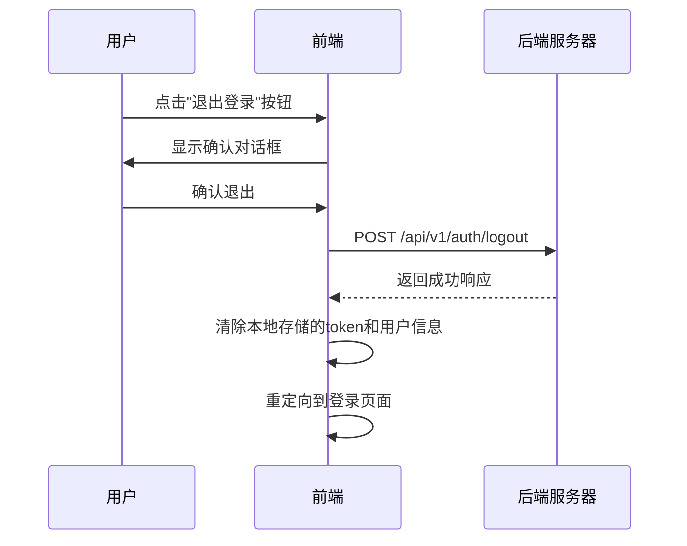

# 个人资料页面交互逻辑

## 1. 页面概述

个人资料页面是用户管理个人信息、查看会员状态、调整偏好设置以及获取帮助与支持的中心枢纽。该页面体现用户在「语撩」平台的身份和个性化设置，也是会员转化的重要触点。

## 2. 页面结构与组件

### 2.1 主要组件

- **顶部个人信息区**：头像、昵称、会员等级展示
- **账户信息卡片**：基本用户资料（昵称、手机号、会员状态等）
- **会员状态区域**：当前会员等级、到期时间、特权信息
- **偏好设置卡片**：通知、隐私、语言等设置项
- **聊天历史设置**：聊天记录保存时长与管理
- **帮助与支持卡片**：常见问题、反馈、评分入口
- **退出登录按钮**：退出当前账号

### 2.2 会员状态组件

- 非会员：展示"立即开通"按钮和会员权益预览
- 会员：展示当前等级、有效期、剩余天数和续费按钮
- 会员特权指示：标记已解锁的特权内容

### 2.3 底部导航栏

与其他页面保持一致的底部导航栏，当前位于"我的"选项卡激活状态。

## 3. 前后端交互流程

### 3.1 获取用户资料流程



### 3.2 修改用户资料流程



### 3.3 更新设置流程



### 3.4 退出登录流程



## 4. API接口设计

### 4.1 获取用户资料接口

**请求：**
```
GET /api/v1/user/profile
Authorization: Bearer {token}
```

**响应：**
```json
{
  "code": "000000",
  "msg": "成功",
  "data": {
    "basicInfo": {
      "userId": "user123",
      "nickname": "用户昵称",
      "avatar": "https://example.com/avatars/user123.jpg",
      "gender": "male",
      "phone": "137****8910",
      "email": "user@example.com",
      "registrationDate": "2023-05-20T14:30:45Z"
    },
    "membershipInfo": {
      "level": 1,  // 0-免费用户 1-VIP会员 2-至尊会员
      "isActive": true,
      "expireDate": "2023-12-31T23:59:59Z",
      "daysRemaining": 127,
      "autoRenew": true,
      "benefits": ["无限次数", "全部风格", "高级分析"]
    },
    "statistics": {
      "totalUsage": 365,
      "favoriteStyles": ["幽默风趣", "浪漫甜蜜"],
      "successRate": 78  // 使用后获得积极回应的百分比
    },
    "settings": {
      "notification": true,
      "privacy": "standard", // standard/strict
      "chatHistoryRetention": 30, // 单位：天
      "language": "zh-CN"
    }
  }
}
```

### 4.2 更新用户资料接口

**请求：**
```
PUT /api/v1/user/profile
Content-Type: application/json
Authorization: Bearer {token}

{
  "nickname": "新昵称",
  "avatar": "base64编码的头像图片",  // 可选，上传新头像
  "email": "newemail@example.com"
}
```

**响应：**
```json
{
  "code": "000000",
  "msg": "成功",
  "data": {
    "userId": "user123",
    "nickname": "新昵称",
    "avatar": "https://example.com/avatars/user123_new.jpg",
    "email": "newemail@example.com",
    "updatedAt": "2023-06-18T10:25:30Z"
  }
}
```

### 4.3 更新用户设置接口

**请求：**
```
PUT /api/v1/user/settings
Content-Type: application/json
Authorization: Bearer {token}

{
  "notification": false,
  "privacy": "strict",
  "chatHistoryRetention": 90,
  "language": "en-US"
}
```

**响应：**
```json
{
  "code": "000000",
  "msg": "成功",
  "data": {
    "settings": {
      "notification": false,
      "privacy": "strict",
      "chatHistoryRetention": 90,
      "language": "en-US"
    },
    "updatedAt": "2023-06-18T11:30:15Z"
  }
}
```

### 4.4 退出登录接口

**请求：**
```
POST /api/v1/auth/logout
Authorization: Bearer {token}
```

**响应：**
```json
{
  "code": "000000",
  "msg": "成功",
  "data": {
    "logoutTime": "2023-06-18T15:40:22Z"
  }
}
```

## 5. 数据存储设计

### 5.1 用户数据表设计

```sql
CREATE TABLE users (
    user_id VARCHAR(32) PRIMARY KEY,
    nickname VARCHAR(50) NOT NULL,
    avatar_url VARCHAR(200),
    gender VARCHAR(10),
    phone VARCHAR(15),
    email VARCHAR(100),
    password_hash VARCHAR(100),  -- 加密存储
    registration_date TIMESTAMP NOT NULL,
    last_login_date TIMESTAMP,
    status VARCHAR(10) DEFAULT 'active',
    created_at TIMESTAMP NOT NULL,
    updated_at TIMESTAMP NOT NULL
);

CREATE TABLE user_membership (
    user_id VARCHAR(32) PRIMARY KEY REFERENCES users(user_id),
    level INT DEFAULT 0,  -- 0:免费用户 1:VIP会员 2:至尊会员
    start_date TIMESTAMP,
    expire_date TIMESTAMP,
    auto_renew BOOLEAN DEFAULT FALSE,
    payment_method VARCHAR(20),
    last_payment_id VARCHAR(50),
    created_at TIMESTAMP NOT NULL,
    updated_at TIMESTAMP NOT NULL
);

CREATE TABLE user_settings (
    user_id VARCHAR(32) PRIMARY KEY REFERENCES users(user_id),
    notification BOOLEAN DEFAULT TRUE,
    privacy VARCHAR(10) DEFAULT 'standard',
    chat_history_retention INT DEFAULT 30,
    language VARCHAR(10) DEFAULT 'zh-CN',
    created_at TIMESTAMP NOT NULL,
    updated_at TIMESTAMP NOT NULL
);
```

## 6. 前端交互细节

### 6.1 编辑资料弹窗

- **头像上传**：支持拍照/相册选择，图片裁剪功能
- **表单验证**：实时验证输入，提供格式指导
- **提交反馈**：显示加载状态和成功/失败提示
- **取消确认**：有未保存更改时弹出确认提示

### 6.2 设置项交互

- **开关切换**：即时发送更新请求，提供视觉反馈
- **选项选择**：下拉菜单或单选列表，确认后保存
- **保存状态**：显示"已保存"或"保存中"状态提示
- **重置选项**：提供重置为默认设置的功能

### 6.3 会员状态展示

- **倒计时**：会员即将到期时显示醒目的倒计时
- **特权图标**：使用图标直观展示各项会员特权
- **升级/续费按钮**：根据当前状态动态展示合适的按钮
- **过期提醒**：会员过期前7天开始显示温馨提醒

## 7. 会员营销策略

### 7.1 资料页会员展示策略

针对非会员用户：
- 在会员状态区域展示"会员专享特权"预览卡片
- 根据用户使用情况，个性化突出最有吸引力的会员权益
- 添加"限时优惠"标签，营造紧迫感
- 显示"解锁全部功能"按钮，直接跳转到会员购买页

针对已是会员的用户：
- 突出展示会员等级和到期时间
- 提供便捷的续费入口，强调自动续费的便利性
- 显示会员专属客服入口，增强会员尊贵感
- 展示可升级的更高级会员特权对比

### 7.2 数据驱动的会员推荐

- 基于用户行为分析，在个人资料页展示最相关的会员权益
- 例如：频繁使用风格功能的用户，强调"解锁全部风格"的会员权益
- 显示个性化的使用统计："你的使用次数已达到免费上限的85%"
- 计算并展示潜在价值："开通会员每天仅需¥1.3，解锁全部功能"

### 7.3 会员身份强化

- 为会员用户提供专属头像框或标识
- 显示"会员日"特别优惠和活动通知
- 展示会员专属功能的使用统计和效果数据
- 提供会员专享的个性化内容推荐

## 8. 用户数据安全

### 8.1 个人数据保护

- **敏感信息处理**：手机号显示时部分遮蔽（如137****8910）
- **密码安全**：不在前端存储明文密码，修改密码时不返回原密码
- **授权管理**：提供已授权第三方应用查看和撤销功能
- **数据导出**：支持用户导出个人数据的功能

### 8.2 隐私设置选项

提供以下隐私选项供用户设置：
- **聊天记录保存**：设置保存时长（7/30/90/365天）
- **数据分析授权**：控制是否允许使用数据进行产品改进
- **个性化设置**：控制是否接收基于行为的个性化推荐

### 8.3 安全最佳实践

- **令牌管理**：资料页面加载时验证令牌有效性，过期自动登出
- **敏感操作确认**：修改重要信息时需要额外验证（如短信验证码）
- **操作日志**：记录重要设置更改，便于安全审计和问题排查
- **会话控制**：提供"查看登录设备"和"踢出其他设备"功能

## 9. 用户体验优化

### 9.1 页面性能

- **懒加载**：非关键组件采用懒加载策略
- **缓存策略**：缓存用户资料数据，减少重复请求
- **预加载**：预测用户可能的下一步操作并预加载资源
- **骨架屏**：加载过程中使用骨架屏减少等待感

### 9.2 易用性提升

- **直观导航**：分组展示设置项，提供清晰的分类
- **上下文帮助**：关键设置旁提供问号图标，点击显示解释
- **状态反馈**：所有操作提供明确的成功/失败反馈
- **无障碍设计**：支持屏幕阅读器，提供足够的颜色对比度

### 9.3 留存策略

- **完整度指示**：展示"个人资料完整度"进度条，鼓励完善
- **徽章系统**：为完成各项设置授予成就徽章
- **定期提醒**：定期提示用户更新个人资料和检查隐私设置
- **便捷通道**：提供快速访问最常用功能的捷径

## 10. 数据分析与优化

### 10.1 关键指标追踪

- **会员转化率**：从资料页点击会员按钮到成功购买的转化率
- **设置完整度**：用户完成的设置项百分比
- **页面停留时间**：用户在个人资料页的平均停留时间
- **功能使用率**：各设置项和功能的使用频率

### 10.2 A/B测试计划

针对个人资料页面可进行以下A/B测试：

1. **会员推广位置**：顶部横幅 vs 内嵌卡片 vs 浮动按钮
2. **设置项分组方式**：功能分类 vs 使用频率排序
3. **数据可视化**：是否显示使用统计的可视化图表
4. **互动元素**：测试添加游戏化元素（如成就系统）的效果

### 10.3 用户行为分析

通过记录和分析以下用户行为优化页面设计：

- 最常点击的设置项和功能
- 用户修改设置的频率和模式
- 页面区域热力图分析
- 会员转化的关键触发点分析 