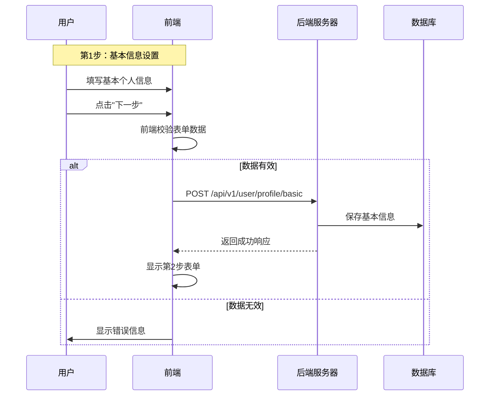
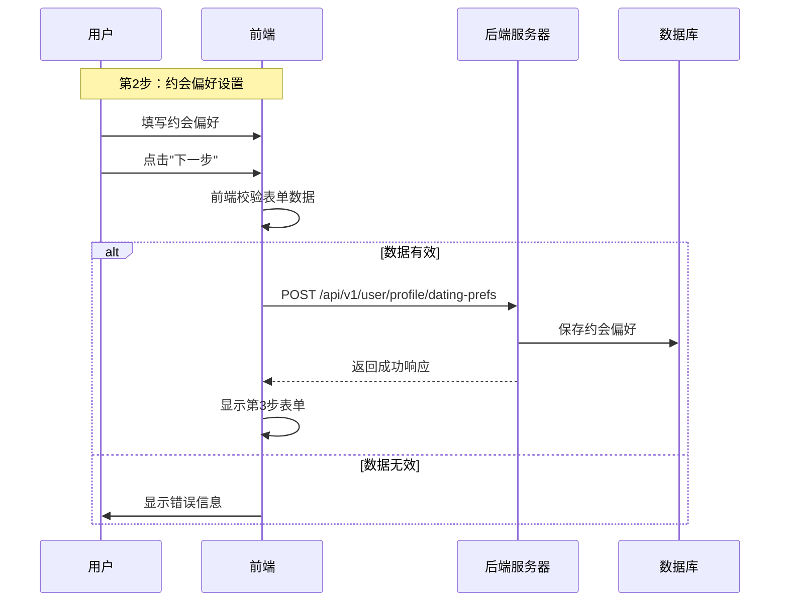
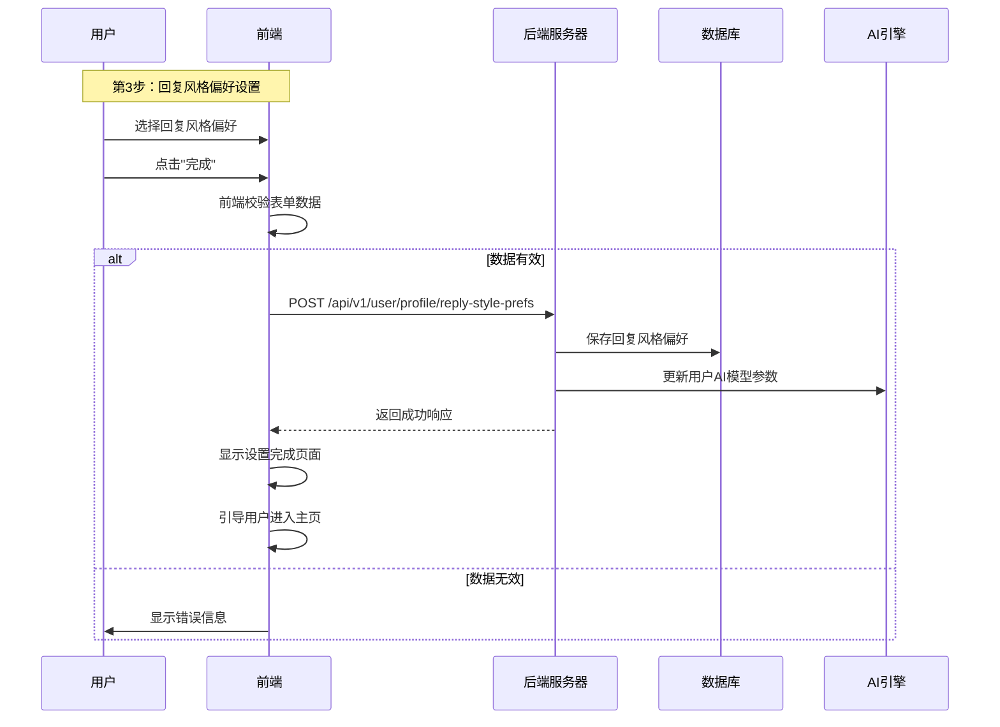

# 用户资料设置页面交互逻辑

## 1. 页面概述

资料设置页面是新用户首次登录后的强制引导流程，通过三步式设置收集用户基本信息、约会偏好和回复风格偏好，以便系统提供更加个性化的服务。

## 2. 页面结构与组件

### 2.1 整体结构

资料设置页面采用多步骤引导式设计：
- 进度指示器 (1/3, 2/3, 3/3)
- 步骤标题和描述
- 表单内容区域
- 步骤控制按钮（上一步/下一步/完成）

### 2.2 三步设置内容

1. **基本信息设置**
   - 性别选择 (男/女)
   - 年龄选择 (18-80岁滑块)
   - 所在城市 (省市级联选择)
   - 职业输入

2. **约会偏好设置**
   - 期望性别 (男/女/不限)
   - 年龄范围 (双端滑块)
   - 感情状态 (单身/已婚/复杂)
   - 约会目的 (多选：认真恋爱/婚姻/社交/朋友)

3. **回复风格偏好设置**
   - 聊天风格偏好 (温柔/幽默/理性/浪漫/神秘 等多选)
   - 回复长度偏好 (简短/适中/详细)
   - 情感表达程度 (含蓄/直接)
   - 示例回复展示和评分

## 3. 前后端交互流程

### 3.1 基本信息设置流程



### 3.2 约会偏好设置流程



### 3.3 回复风格偏好设置流程



## 4. API接口设计

### 4.1 基本信息设置接口

**请求：**
```
POST /api/v1/user/profile/basic
Content-Type: application/json
Authorization: Bearer {token}

{
  "gender": "male",  // 性别: male/female
  "age": 28,         // 年龄: 18-80
  "location": {      // 地理位置
    "province": "广东省",
    "city": "深圳市"
  },
  "occupation": "软件工程师" // 职业
}
```

**响应：**
```json
{
  "code": "000000",
  "msg": "成功",
  "data": {
    "profileId": "用户资料ID",
    "profileCompletion": 33  // 资料完成度百分比
  }
}
```

### 4.2 约会偏好设置接口

**请求：**
```
POST /api/v1/user/profile/dating-prefs
Content-Type: application/json
Authorization: Bearer {token}

{
  "genderPreference": "female",  // 期望性别: male/female/any
  "ageRange": {                  // 年龄范围
    "min": 20,
    "max": 35
  },
  "relationshipStatus": "single", // 感情状态: single/married/complicated
  "datingPurpose": ["serious", "friends"]  // 约会目的
}
```

**响应：**
```json
{
  "code": "000000",
  "msg": "成功",
  "data": {
    "profileId": "用户资料ID",
    "profileCompletion": 66  // 资料完成度百分比
  }
}
```

### 4.3 回复风格偏好设置接口

**请求：**
```
POST /api/v1/user/profile/reply-style-prefs
Content-Type: application/json
Authorization: Bearer {token}

{
  "styles": ["humorous", "romantic", "mysterious"],  // 风格偏好
  "length": "medium",          // 长度偏好: short/medium/detailed
  "emotionExpression": "direct", // 情感表达: implicit/direct
  "sampleReplies": [           // 用户对示例回复的评分
    {
      "replyId": "样例回复1ID",
      "rating": 4  // 1-5评分
    },
    {
      "replyId": "样例回复2ID",
      "rating": 5
    }
  ]
}
```

**响应：**
```json
{
  "code": "000000",
  "msg": "成功",
  "data": {
    "profileId": "用户资料ID",
    "profileCompletion": 100,  // 资料完成度百分比
    "initialRecommendedStyles": [  // 初始推荐的回复风格
      "幽默风趣",
      "浪漫情调"
    ],
    "vipTrial": {  // 赠送的VIP体验信息
      "enabled": true,
      "days": 7,
      "features": ["所有风格", "无限回复"]
    }
  }
}
```

## 5. 数据存储设计

### 5.1 用户资料数据表设计

```sql
CREATE TABLE user_profile (
    user_id VARCHAR(32) PRIMARY KEY,
    gender VARCHAR(10),
    age INT,
    province VARCHAR(20),
    city VARCHAR(20),
    occupation VARCHAR(50),
    created_at TIMESTAMP,
    updated_at TIMESTAMP
);

CREATE TABLE user_dating_preference (
    user_id VARCHAR(32) PRIMARY KEY,
    gender_preference VARCHAR(10),
    min_age INT,
    max_age INT,
    relationship_status VARCHAR(20),
    dating_purpose JSON,
    created_at TIMESTAMP,
    updated_at TIMESTAMP
);

CREATE TABLE user_reply_preference (
    user_id VARCHAR(32) PRIMARY KEY,
    style_preference JSON,
    length_preference VARCHAR(10),
    emotion_expression VARCHAR(10),
    sample_ratings JSON,
    created_at TIMESTAMP,
    updated_at TIMESTAMP
);
```

## 6. 前端验证规则

| 字段 | 验证规则 | 错误提示 |
|------|---------|---------|
| 性别 | 必选 | "请选择您的性别" |
| 年龄 | 18-80之间的整数 | "请选择有效的年龄范围(18-80)" |
| 城市 | 省市两级必选 | "请选择您所在的城市" |
| 约会目的 | 至少选择一项 | "请至少选择一项约会目的" |
| 风格偏好 | 至少选择一项 | "请至少选择一种您偏好的聊天风格" |

## 7. 营销策略

### 7.1 VIP试用激活

完成全部资料设置后，向新用户提供7天VIP会员试用，弹窗显示：
- 试用期限和到期时间
- 可使用的VIP特权列表
- "开始体验"和"了解更多"按钮

### 7.2 引导推荐

基于用户的偏好设置，在完成页面展示：
- "为您推荐的风格"卡片
- "立即尝试"按钮，直接跳转至助手页面
- 简短的使用指引

## 8. 跳过机制

允许用户跳过详细设置，但需要保留最低限度的必要信息收集：
- 性别 (必填)
- 约会目的 (必填)
- 其他字段可选填

跳过后的数据补全策略：
- 使用默认值填充必要字段
- 在后续使用过程中通过交互收集更多偏好信息
- 在个人资料页面提醒用户完善信息 