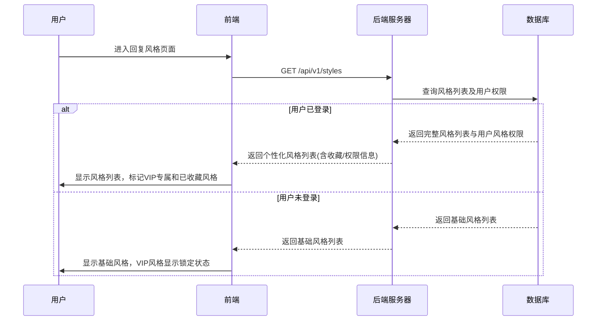
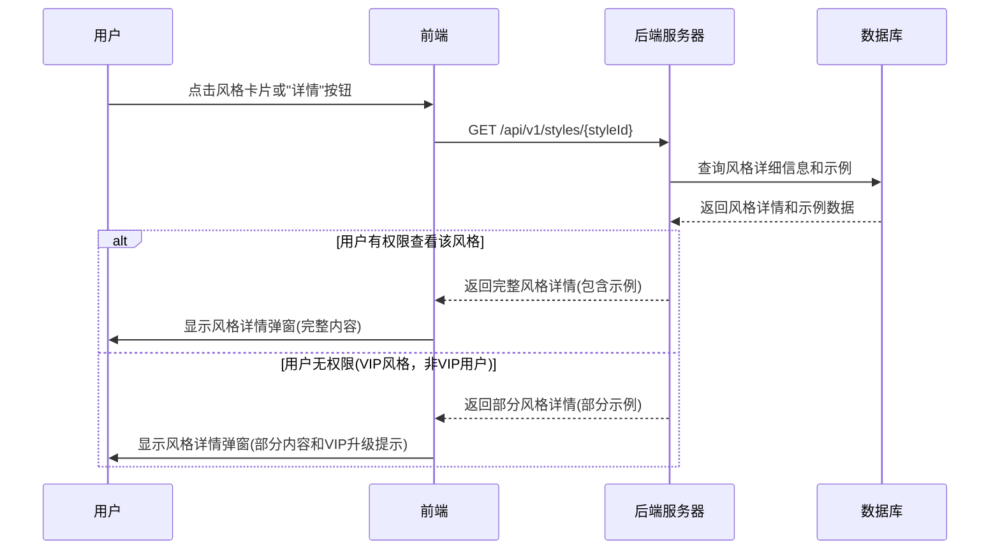
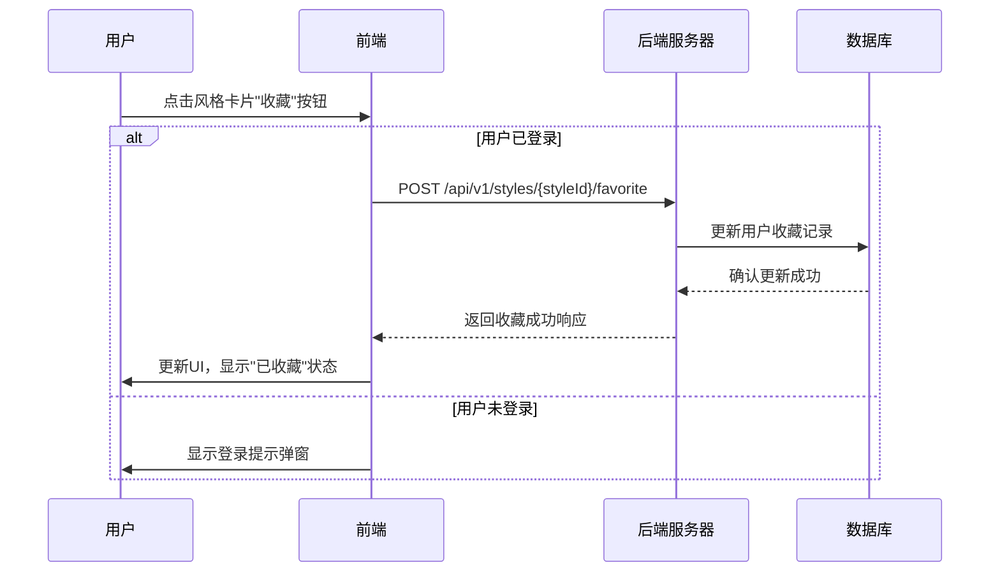
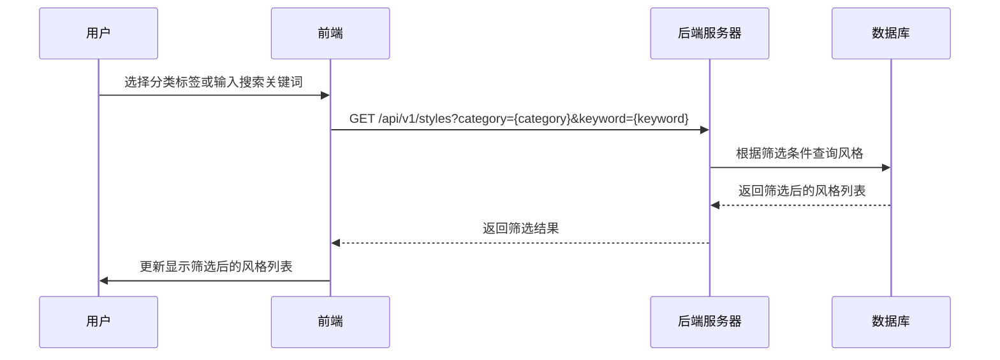

# 回复风格页面交互逻辑

## 1. 页面概述

回复风格页面是「语撩」应用中用户浏览、管理和购买回复风格的专属页面，包含基础风格和高级VIP风格的展示、详情查看、偏好设置和个性化推荐功能。

## 2. 页面结构与组件

### 2.1 主要组件

- **导航栏**：品牌标识、页面切换链接
- **风格分类筛选条**：全部/免费/VIP专属/我的收藏等分类标签
- **搜索输入框**：搜索特定风格关键词
- **风格卡片网格**：展示所有可用回复风格的卡片
- **风格详情弹窗**：展示风格详细说明和示例
- **我的收藏区域**：快速访问已收藏风格
- **推荐风格区域**：基于用户行为的个性化推荐
- **VIP专属区域**：突出展示VIP会员可用的高级风格

### 2.2 风格卡片组件

每个风格卡片包含以下元素：

- 风格名称和简短描述
- 风格标签（免费/VIP专属/新上线等）
- 代表性视觉元素或图标
- 示例预览按钮
- 收藏/取消收藏按钮
- 使用频率指示（常用/推荐等）

## 3. 前后端交互流程

### 3.1 获取风格列表流程



### 3.2 风格详情查看流程



### 3.3 收藏风格流程



### 3.4 风格筛选/搜索流程



## 4. API接口设计

### 4.1 获取风格列表接口

**请求：**
```
GET /api/v1/styles?category={category}&keyword={keyword}&page={page}&size={size}
Authorization: Bearer {token} (可选)
```

**参数说明：**
- `category`: 风格分类(all/free/vip/favorite)，默认为`all`
- `keyword`: 搜索关键词，用于模糊搜索风格名称或描述
- `page`: 分页页码，默认为1
- `size`: 每页数量，默认为20

**响应：**
```json
{
  "code": "000000",
  "msg": "成功",
  "data": {
    "styles": [
      {
        "styleId": "style123",
        "name": "幽默风趣型",
        "description": "轻松诙谐，巧妙风趣，让对话充满乐趣",
        "tags": ["互动型", "社交场合"],
        "isVipOnly": false,
        "isFavorite": true,
        "usageCount": 42,
        "samplePreview": "看来我们有共同爱好，不如周末一起去体验一下？保证让你笑到肚子疼！",
        "category": "social",
        "popularity": 4.8,
        "iconUrl": "https://example.com/icons/humorous.png"
      },
      {
        "styleId": "style456",
        "name": "浪漫甜蜜型",
        "description": "温柔浪漫，情感丰富，传递爱意与关怀",
        "tags": ["情感型", "约会场合"],
        "isVipOnly": true,
        "isFavorite": false,
        "usageCount": 0,
        "samplePreview": "和你聊天的每一刻都让我期待下一次相遇...",
        "category": "romantic",
        "popularity": 4.9,
        "iconUrl": "https://example.com/icons/romantic.png"
      }
      // 更多风格...
    ],
    "pagination": {
      "totalItems": 28,
      "totalPages": 2,
      "currentPage": 1,
      "pageSize": 20
    },
    "userInfo": {
      "isVip": false,
      "favoriteCount": 5,
      "recommendedStyles": ["style123", "style789"]
    }
  }
}
```

### 4.2 获取风格详情接口

**请求：**
```
GET /api/v1/styles/{styleId}
Authorization: Bearer {token} (可选)
```

**响应：**
```json
{
  "code": "000000",
  "msg": "成功",
  "data": {
    "styleId": "style123",
    "name": "幽默风趣型",
    "description": "轻松诙谐，巧妙风趣，让对话充满乐趣",
    "longDescription": "这种风格的回复充满机智与幽默，善于使用双关语、俏皮话和巧妙比喻。适合活跃气氛、打破僵局，让对话轻松愉快。常用于活跃社交氛围，对缓解紧张情绪特别有效。",
    "tags": ["互动型", "社交场合", "缓解紧张"],
    "isVipOnly": false,
    "isFavorite": true,
    "usageCount": 42,
    "category": "social",
    "popularity": 4.8,
    "iconUrl": "https://example.com/icons/humorous.png",
    "examples": [
      {
        "receivedMessage": "今天工作好累啊，感觉整个人都不好了",
        "replyExample": "听起来你需要的不只是安慰，还需要一杯咖啡，一块巧克力，外加一个让你笑出声的笑话！要不要听听我最近收集的'办公室生存指南'？"
      },
      {
        "receivedMessage": "你平时周末喜欢做什么？",
        "replyExample": "我的周末活动清单：60%是探索新咖啡馆，30%是假装自己是Netflix评论家，剩下10%嘛...是计划下周要探索哪些新咖啡馆！你呢？"
      },
      {
        "receivedMessage": "最近有什么好看的电影推荐吗？",
        "replyExample": "根据我不存在的电影评论家资格证书，我强烈推荐[电影名]。不过我得警告你，看完后你可能会用'这不就是我生活的翻版吗'这种眼光看我，哈哈！你喜欢什么类型的？"
      }
    ],
    "bestSuitedFor": ["破冰对话", "日常闲聊", "缓解尴尬"],
    "userFeedback": {
      "averageRating": 4.7,
      "totalRatings": 1245,
      "favoritePercentage": 68
    }
  }
}
```

### 4.3 收藏风格接口

**请求：**
```
POST /api/v1/styles/{styleId}/favorite
Content-Type: application/json
Authorization: Bearer {token}

{
  "action": "add"  // add: 添加收藏, remove: 取消收藏
}
```

**响应：**
```json
{
  "code": "000000",
  "msg": "成功",
  "data": {
    "styleId": "style123",
    "isFavorite": true,
    "favoriteCount": 6,
    "updatedAt": "2023-06-16T10:30:45Z"
  }
}
```

### 4.4 获取推荐风格接口

**请求：**
```
GET /api/v1/styles/recommended
Authorization: Bearer {token}
```

**响应：**
```json
{
  "code": "000000",
  "msg": "成功",
  "data": {
    "recommended": [
      {
        "styleId": "style789",
        "name": "知性成熟型",
        "description": "深度思考，理性分析，展现个人见解",
        "reason": "based_on_usage",  // 基于用户使用历史
        "matchScore": 92            // 匹配度分数
      },
      {
        "styleId": "style456",
        "name": "浪漫甜蜜型",
        "description": "温柔浪漫，情感丰富，传递爱意与关怀",
        "reason": "popular_with_similar_users", // 基于相似用户受欢迎度
        "matchScore": 85
      }
      // 更多推荐...
    ],
    "basedOn": [
      "past_usage", 
      "favorite_styles", 
      "user_demographics"
    ]
  }
}
```

## 5. 前端交互细节

### 5.1 风格卡片交互

- **悬停效果**：卡片轻微放大(scale: 1.03)，添加阴影深度
- **收藏按钮**：点击切换收藏状态，附带视觉反馈（心形填充/轮廓变化）
- **快速预览**：长按卡片显示风格示例气泡，无需打开详情
- **权限提示**：VIP专属风格对非VIP用户显示锁定图标和锁定覆盖层

### 5.2 风格详情弹窗

- **示例展示**：轮播形式展示3-5个对话场景和回复示例
- **适用场景**：图标化展示最适合的对话场景
- **用户反馈**：显示其他用户对此风格的评分和使用频率
- **使用按钮**：直接跳转到助手页面并预选此风格
- **VIP升级**：非VIP用户查看VIP风格时，显示"解锁全部功能"按钮

### 5.3 筛选与搜索

- **实时搜索**：输入关键词后即时过滤显示结果（防抖处理，300ms延迟）
- **空结果处理**：搜索无结果时显示推荐风格和建议
- **历史记录**：保存最近的搜索记录，便于快速访问
- **高级筛选**：支持多维度组合筛选（场景、情感倾向、用途等）

## 6. 数据存储设计

### 6.1 风格数据表设计

```sql
CREATE TABLE reply_styles (
    style_id VARCHAR(32) PRIMARY KEY,
    name VARCHAR(50) NOT NULL,
    description VARCHAR(200) NOT NULL,
    long_description TEXT,
    tags JSON,
    is_vip_only BOOLEAN DEFAULT FALSE,
    category VARCHAR(30),
    popularity DECIMAL(3,1),
    icon_url VARCHAR(200),
    created_at TIMESTAMP,
    updated_at TIMESTAMP
);

CREATE TABLE style_examples (
    example_id VARCHAR(32) PRIMARY KEY,
    style_id VARCHAR(32) REFERENCES reply_styles(style_id),
    received_message TEXT NOT NULL,
    reply_example TEXT NOT NULL,
    context VARCHAR(100),
    is_vip_only BOOLEAN DEFAULT FALSE,
    display_order INT
);

CREATE TABLE user_favorite_styles (
    user_id VARCHAR(32),
    style_id VARCHAR(32) REFERENCES reply_styles(style_id),
    created_at TIMESTAMP,
    PRIMARY KEY (user_id, style_id)
);

CREATE TABLE user_style_usage (
    user_id VARCHAR(32),
    style_id VARCHAR(32) REFERENCES reply_styles(style_id),
    usage_count INT DEFAULT 0,
    last_used_at TIMESTAMP,
    PRIMARY KEY (user_id, style_id)
);
```

## 7. 会员营销策略

### 7.1 分层风格策略

将风格按价值和吸引力分为三个层次：

1. **基础免费风格**（3-5种）
   - 友好礼貌型
   - 简洁直接型
   - 关心体贴型

2. **普通VIP风格**（8-10种）
   - 幽默风趣型
   - 浪漫甜蜜型
   - 专业知性型
   - 自信果断型
   - 神秘吸引型
   - 等

3. **高级VIP风格**（5-8种）
   - 欲擒故纵型
   - 高情商应对型
   - 策略化追求型
   - 私密暧昧型
   - 个性化定制风格

### 7.2 VIP风格体验策略

- **预览体验**：允许免费用户查看VIP风格的部分示例（1个示例，其余示例模糊处理）
- **限时试用**：每周开放1个VIP风格供免费用户使用24小时
- **新风格引入**：定期引入新风格，提前预告并打造期待感
- **季节性风格**：针对特定节日或季节推出限时风格（如七夕专属浪漫风格）

### 7.3 转化触发点设计

1. **兴趣触发**
   - 当用户查看同一VIP风格详情3次以上时，弹出特惠转化窗口
   - 当用户使用基础风格达到频率上限时，推荐类似的VIP风格

2. **价值展示**
   - 在风格详情页展示真实成功案例："80%的用户使用此风格获得了积极回应"
   - 设置"热门程度"和"回复成功率"指标，突显VIP风格的高价值

3. **社交推动**
   - "好友推荐"标记：显示此风格被多少相似用户收藏
   - 匿名成功案例分享："一位用户使用此风格成功约到了心仪对象"

### 7.4 VIP价值传达

在风格页面向免费用户展示的VIP价值信息：

1. **数量对比**：免费风格(5种) vs VIP风格(20+种)
2. **质量对比**：显示VIP风格的平均成功率高于免费风格
3. **独特性强调**：标记"独家"、"高级"、"定制化"等价值标签
4. **统计数据**："90%的成功约会用户都使用了VIP风格"

## 8. 数据分析与优化

### 8.1 关键指标追踪

- **风格受欢迎度**：各风格被查看、收藏和使用的频率
- **转化贡献**：各风格对VIP转化的贡献度
- **用户偏好分布**：不同用户群体对风格的偏好差异
- **风格效果**：使用不同风格后获得积极回应的比率

### 8.2 A/B测试计划

可进行的优化实验：

1. **风格展示方式**：卡片式 vs 列表式 vs 大图预览式
2. **风格分类方式**：按场景分类 vs 按情感类型分类 vs 按关系阶段分类
3. **VIP标记方式**：锁定图标 vs 半透明蒙层 vs "VIP专享"标签
4. **推荐算法**：基于历史行为推荐 vs 基于相似用户推荐 vs 基于当前场景推荐

### 8.3 营销效果分析模型

```
风格转化效率指数 = (查看到收藏转化率 * 0.3) + (收藏到使用转化率 * 0.3) + (使用到VIP转化贡献率 * 0.4)
```

定期分析各风格的转化效率指数，优化风格展示顺序和营销资源分配，重点推广高转化效率的风格。

### 8.4 个性化推荐策略

基于用户行为历史和相似用户群体数据，实现以下推荐策略：

1. **场景关联推荐**：根据用户描述的场景推荐最适合的风格
2. **互补风格推荐**：推荐用户较少使用但可能有好效果的互补风格
3. **升级路径推荐**：为准备升级VIP的用户突出展示最能打动他们的VIP风格
4. **时间相关推荐**：在不同时段（周末、节日）推荐相应的风格

## 9. 迭代优化路径

### 9.1 第一阶段（基础功能）

- 实现基本风格卡片展示和详情查看
- 简单的收藏功能和分类筛选
- 基础的免费/VIP权限区分

### 9.2 第二阶段（体验优化）

- 添加风格预览和示例展示
- 实现个性化推荐算法
- 完善搜索和筛选功能
- 优化VIP风格的营销展示

### 9.3 第三阶段（高级功能）

- 引入AI辅助的风格匹配（根据用户的聊天记录自动推荐风格）
- 用户自定义风格功能（高级VIP用户）
- 风格效果追踪和反馈系统
- 社区互动功能（风格评价、分享成功案例） 