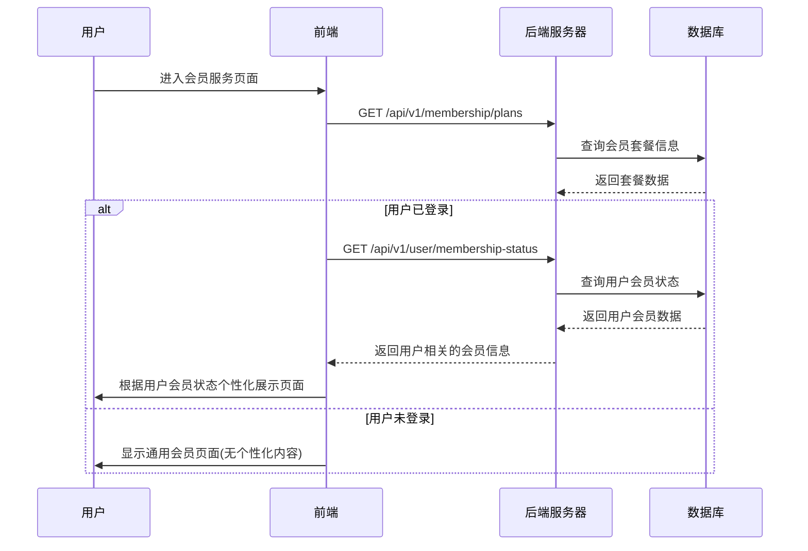
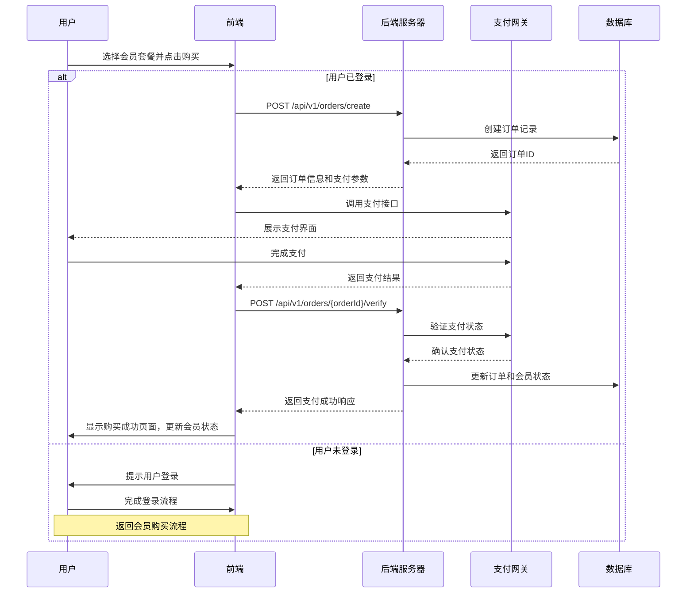
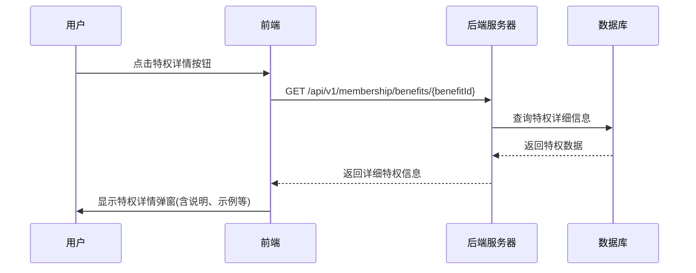
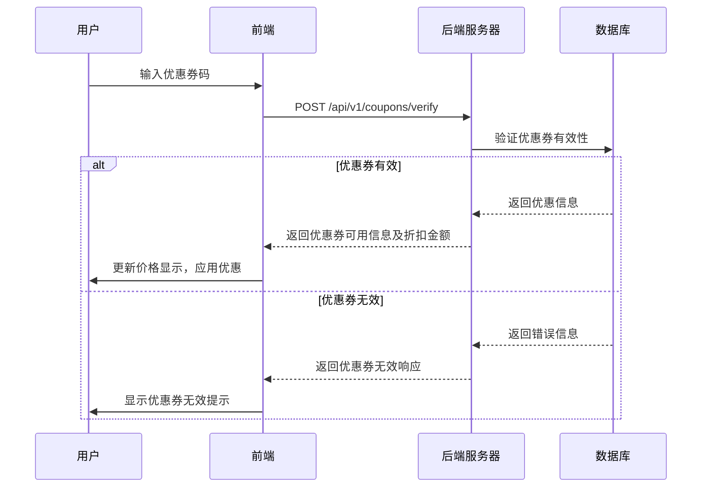

# 会员服务页面交互逻辑

## 1. 页面概述

会员服务页面是「语撩」应用的核心变现页面，展示会员套餐、特权比较和促销活动，旨在将免费用户转化为付费会员，以及鼓励现有会员升级或续费。页面采用精心设计的视觉效果和交互体验，突出会员价值，促进用户决策。

## 2. 页面结构与组件

### 2.1 主要组件

- **页面顶部区域**：醒目的品牌标识、吸引人的标题和副标题
- **会员套餐卡片**：展示不同等级会员的价格和权益
- **特权对比表格**：清晰对比免费与付费会员的功能差异
- **促销活动区域**：展示限时优惠和特别活动
- **VIP功能展示区**：图文并茂展示会员专属功能
- **用户评价区域**：展示会员用户的真实评价和成功案例
- **常见问题区域**：解答潜在用户的疑虑
- **底部转化按钮**：固定在页面底部的购买/续费按钮

### 2.2 会员套餐组件

每个会员套餐卡片包含以下元素：

- 套餐名称（如"VIP会员"、"至尊会员"）
- 价格信息（月费/年费，原价/优惠价）
- 推荐标签（如"最受欢迎"、"性价比之选"）
- 核心特权简介（3-5条主要权益）
- 购买按钮

### 2.3 响应式设计

- **手机视图**：套餐卡片纵向排列，关键信息突出
- **平板视图**：套餐卡片网格布局，增加视觉对比
- **桌面视图**：套餐并排展示，提供完整特权对比表

## 3. 前后端交互流程

### 3.1 获取会员信息流程



### 3.2 会员购买流程



### 3.3 会员特权查看流程



### 3.4 优惠券使用流程



## 4. API接口设计

### 4.1 获取会员套餐接口

**请求：**
```
GET /api/v1/membership/plans
Authorization: Bearer {token} (可选)
```

**响应：**
```json
{
  "code": "000000",
  "msg": "成功",
  "data": {
    "plans": [
      {
        "planId": "free",
        "name": "免费版",
        "price": 0,
        "period": "永久",
        "features": [
          {
            "featureId": "basic_styles",
            "name": "基础回复风格",
            "description": "3种基础回复风格",
            "included": true
          },
          {
            "featureId": "daily_limit",
            "name": "每日使用次数",
            "description": "20次/天",
            "included": true
          },
          {
            "featureId": "vip_styles",
            "name": "高级回复风格",
            "description": "15+种高级风格",
            "included": false
          }
        ],
        "recommended": false
      },
      {
        "planId": "vip_monthly",
        "name": "VIP会员",
        "price": 39.99,
        "originalPrice": 59.99,
        "period": "monthly",
        "features": [
          {
            "featureId": "basic_styles",
            "name": "基础回复风格",
            "description": "所有基础回复风格",
            "included": true
          },
          {
            "featureId": "vip_styles",
            "name": "高级回复风格",
            "description": "解锁15+种高级风格",
            "included": true
          },
          {
            "featureId": "daily_limit",
            "name": "使用次数",
            "description": "200次/天",
            "included": true
          },
          {
            "featureId": "emotion_analysis",
            "name": "情感分析",
            "description": "对话情感解析",
            "included": true
          }
        ],
        "recommended": true,
        "popularityPercentage": 68
      },
      {
        "planId": "premium_monthly",
        "name": "至尊会员",
        "price": 99.99,
        "originalPrice": 129.99,
        "period": "monthly",
        "features": [
          {
            "featureId": "all_styles",
            "name": "全部回复风格",
            "description": "所有风格+独家至尊风格",
            "included": true
          },
          {
            "featureId": "unlimited_usage",
            "name": "使用次数",
            "description": "无限次使用",
            "included": true
          },
          {
            "featureId": "custom_style",
            "name": "定制风格",
            "description": "创建个人专属风格",
            "included": true
          },
          {
            "featureId": "priority_response",
            "name": "优先响应",
            "description": "生成速度提升50%",
            "included": true
          },
          {
            "featureId": "vip_support",
            "name": "专属客服",
            "description": "7*24小时VIP客服",
            "included": true
          }
        ],
        "recommended": false
      }
    ],
    "promotions": [
      {
        "promotionId": "summer_sale",
        "title": "夏季特惠",
        "description": "VIP年费低至7折",
        "endTime": "2023-08-31T23:59:59Z",
        "badgeText": "限时优惠"
      }
    ],
    "userSpecific": {
      "recommendedPlan": "vip_monthly",
      "potentialSavings": "约省¥240/年",
      "usageStats": {
        "currentPlan": "free",
        "usagePercentage": 85,
        "remainingUsage": 3
      }
    }
  }
}
```

### 4.2 创建订单接口

**请求：**
```
POST /api/v1/orders/create
Content-Type: application/json
Authorization: Bearer {token}

{
  "planId": "vip_monthly",
  "paymentMethod": "wechat",  // wechat/alipay
  "couponCode": "SUMMER20",   // 可选，优惠券码
  "autoRenew": true,          // 是否自动续费
  "source": "vip_page"        // 购买来源
}
```

**响应：**
```json
{
  "code": "000000",
  "msg": "成功",
  "data": {
    "orderId": "ORD20230615001",
    "planName": "VIP会员(月付)",
    "amount": 39.99,
    "discountAmount": 20.00,  // 优惠金额
    "finalAmount": 19.99,     // 最终支付金额
    "createTime": "2023-06-15T14:30:22Z",
    "expireTime": "2023-06-15T14:45:22Z",  // 订单有效期
    "paymentInfo": {
      "paymentMethod": "wechat",
      "payParams": {
        "appId": "wx123456789",
        "timeStamp": "1623760222",
        "nonceStr": "random_string",
        "package": "prepay_id=wx15143022461879a3fb92e5faa3d4550000",
        "signType": "RSA",
        "paySign": "sign_string"
      }
    }
  }
}
```

### 4.3 验证支付结果接口

**请求：**
```
POST /api/v1/orders/{orderId}/verify
Authorization: Bearer {token}
```

**响应：**
```json
{
  "code": "000000",
  "msg": "成功",
  "data": {
    "orderId": "ORD20230615001",
    "status": "paid",  // unpaid/paid/failed/expired
    "paymentTime": "2023-06-15T14:32:10Z",
    "membershipInfo": {
      "planId": "vip_monthly",
      "startTime": "2023-06-15T14:32:10Z",
      "expireTime": "2023-07-15T14:32:10Z",
      "autoRenew": true
    },
    "nextSteps": [
      {
        "type": "explore_features",
        "title": "探索VIP功能",
        "url": "/styles?filter=vip"
      },
      {
        "type": "share_promotion",
        "title": "分享获得额外7天VIP",
        "url": "/share"
      }
    ]
  }
}
```

### 4.4 验证优惠券接口

**请求：**
```
POST /api/v1/coupons/verify
Content-Type: application/json
Authorization: Bearer {token}

{
  "couponCode": "SUMMER20",
  "planId": "vip_monthly"
}
```

**响应：**
```json
{
  "code": "000000",
  "msg": "成功",
  "data": {
    "couponCode": "SUMMER20",
    "valid": true,
    "discountType": "percentage",  // percentage/fixed
    "discountValue": 20,           // 百分比或固定金额
    "originalPrice": 39.99,
    "discountedPrice": 31.99,
    "expireTime": "2023-08-31T23:59:59Z",
    "conditions": "仅适用于月付会员",
    "usageLimit": "每个用户限用一次"
  }
}
```

## 5. 数据存储设计

### 5.1 会员与订单数据表设计

```sql
CREATE TABLE membership_plans (
    plan_id VARCHAR(32) PRIMARY KEY,
    name VARCHAR(50) NOT NULL,
    price DECIMAL(10,2) NOT NULL,
    original_price DECIMAL(10,2),
    period VARCHAR(20) NOT NULL,  -- monthly/quarterly/annually/lifetime
    description TEXT,
    is_recommended BOOLEAN DEFAULT FALSE,
    is_active BOOLEAN DEFAULT TRUE,
    created_at TIMESTAMP NOT NULL,
    updated_at TIMESTAMP NOT NULL
);

CREATE TABLE plan_features (
    feature_id VARCHAR(32) PRIMARY KEY,
    plan_id VARCHAR(32) REFERENCES membership_plans(plan_id),
    name VARCHAR(50) NOT NULL,
    description VARCHAR(200),
    is_highlighted BOOLEAN DEFAULT FALSE,
    sort_order INT,
    created_at TIMESTAMP NOT NULL,
    updated_at TIMESTAMP NOT NULL
);

CREATE TABLE promotion_campaigns (
    promotion_id VARCHAR(32) PRIMARY KEY,
    title VARCHAR(100) NOT NULL,
    description TEXT,
    start_time TIMESTAMP NOT NULL,
    end_time TIMESTAMP NOT NULL,
    discount_type VARCHAR(20) NOT NULL,  -- percentage/fixed/free_days
    discount_value DECIMAL(10,2) NOT NULL,
    applicable_plans JSON,  -- 适用的计划ID列表
    is_active BOOLEAN DEFAULT TRUE,
    created_at TIMESTAMP NOT NULL,
    updated_at TIMESTAMP NOT NULL
);

CREATE TABLE coupon_codes (
    coupon_code VARCHAR(32) PRIMARY KEY,
    promotion_id VARCHAR(32) REFERENCES promotion_campaigns(promotion_id),
    discount_type VARCHAR(20) NOT NULL,  -- percentage/fixed/free_days
    discount_value DECIMAL(10,2) NOT NULL,
    start_time TIMESTAMP NOT NULL,
    end_time TIMESTAMP NOT NULL,
    max_uses INT,
    current_uses INT DEFAULT 0,
    is_active BOOLEAN DEFAULT TRUE,
    applicable_plans JSON,  -- 适用的计划ID列表
    created_at TIMESTAMP NOT NULL,
    updated_at TIMESTAMP NOT NULL
);

CREATE TABLE user_orders (
    order_id VARCHAR(32) PRIMARY KEY,
    user_id VARCHAR(32) NOT NULL,
    plan_id VARCHAR(32) REFERENCES membership_plans(plan_id),
    amount DECIMAL(10,2) NOT NULL,
    discount_amount DECIMAL(10,2) DEFAULT 0,
    final_amount DECIMAL(10,2) NOT NULL,
    coupon_code VARCHAR(32),
    promotion_id VARCHAR(32),
    payment_method VARCHAR(20),
    status VARCHAR(20) NOT NULL,  -- created/paid/failed/expired/refunded
    create_time TIMESTAMP NOT NULL,
    payment_time TIMESTAMP,
    expire_time TIMESTAMP,
    auto_renew BOOLEAN DEFAULT FALSE,
    source VARCHAR(50),  -- 购买来源
    created_at TIMESTAMP NOT NULL,
    updated_at TIMESTAMP NOT NULL
);

CREATE TABLE user_memberships (
    user_id VARCHAR(32) PRIMARY KEY,
    plan_id VARCHAR(32) REFERENCES membership_plans(plan_id),
    start_time TIMESTAMP,
    expire_time TIMESTAMP,
    is_active BOOLEAN DEFAULT FALSE,
    auto_renew BOOLEAN DEFAULT FALSE,
    original_order_id VARCHAR(32),
    next_billing_date TIMESTAMP,
    next_billing_amount DECIMAL(10,2),
    cancel_reason VARCHAR(100),
    created_at TIMESTAMP NOT NULL,
    updated_at TIMESTAMP NOT NULL
);
```

## 6. 会员价格策略

### 6.1 基础价格架构

设计三级会员价格体系：

1. **免费版**：
   - 价格：¥0
   - 定位：产品体验，功能受限

2. **VIP会员**：
   - 月付价格：¥39.99/月
   - 季付价格：¥99.99/季（相当于¥33.33/月，节省17%）
   - 年付价格：¥299.99/年（相当于¥25.00/月，节省37%）
   - 定位：核心目标用户群的主要选择

3. **至尊会员**：
   - 月付价格：¥99.99/月
   - 季付价格：¥269.99/季（相当于¥90.00/月，节省10%）
   - 年付价格：¥899.99/年（相当于¥75.00/月，节省25%）
   - 定位：高端用户及企业用户

### 6.2 心理定价策略

应用以下心理定价策略：

1. **锚定效应**：
   - 显示原价与折扣价对比
   - 将月付价格转化为日均价格（"每天仅需¥1.33"）
   - 将VIP会员与至尊会员并排展示，突出VIP会员性价比

2. **稀缺性原则**：
   - 限时促销倒计时
   - "限量特惠名额"指示
   - 季节性促销（如"七夕特惠"）

3. **价值感知**：
   - 计算并展示节省金额
   - 折算每次使用成本："每次使用仅¥0.2"
   - 与竞品服务价格比较

### 6.3 促销与折扣策略

设计以下促销机制：

1. **首次购买优惠**：
   - 新用户首次购买享7折优惠
   - 7天免费试用后首次购买折扣

2. **长期订阅激励**：
   - 年付赠送2个月（实际14个月服务）
   - 年付赠送30次好友邀请码

3. **季节性促销**：
   - 节日专属优惠（春节、七夕、双十一等）
   - 暑期/寒假学生特惠

4. **会员保留策略**：
   - 到期前7天发送续费折扣
   - 流失用户召回特惠（停用30天后）

### 6.4 付费转化触发点

在以下场景触发付费转化流程：

1. **功能使用限制触发**：
   - 免费次数用尽时
   - 尝试使用VIP专属功能时
   - 生成质量对比展示时

2. **高价值时刻触发**：
   - 用户获得积极回应后
   - 周五/周六晚间（约会高峰期）
   - 用户连续使用时（活跃用户）

3. **社交压力触发**：
   - "80%的活跃用户已升级为VIP"
   - "您的好友已升级为VIP会员"
   - "VIP用户的回复成功率提升40%"

## 7. 前端交互优化

### 7.1 页面加载与动画

- **渐进式加载**：先加载页面框架，再加载详细内容
- **入场动画**：会员卡片层叠入场效果
- **滚动响应**：滚动到特定区域触发特权展示动画
- **微交互**：鼠标悬停时卡片轻微抬升，增强交互感

### 7.2 用户决策辅助

- **套餐对比工具**：可视化展示不同套餐的价值对比
- **个性化推荐**：基于用户行为推荐最适合的套餐
- **试算器**：用户可调整使用频率，计算实际价值
- **决策辅助提示**：如"95%选择年付方案的用户续费率更高"

### 7.3 支付流程优化

- **简化步骤**：减少支付流程中的步骤和表单填写
- **透明定价**：清晰展示价格明细，包括折扣和最终价格
- **延迟确认**：支付完成后立即显示确认信息和会员状态
- **续费提醒**：提供明确的续费日期和金额信息

## 8. 会员营销策略

### 8.1 跨页面会员促销

在应用各个页面设置会员转化触点：

1. **助手页面**：
   - 次数用尽时显示VIP转化弹窗
   - 使用进度条显示剩余免费次数
   - VIP风格标签展示，引导关注

2. **风格页面**：
   - VIP风格预览功能
   - 风格效果对比展示
   - "解锁全部风格"按钮

3. **个人资料页**：
   - 会员权益概览区域
   - 使用统计与VIP转化建议
   - 会员专属标识诱导

### 8.2 社交传播策略

利用社交分享增加会员转化：

1. **会员共享机制**：
   - VIP用户可分享限时体验码给好友
   - 邀请好友成功购买获额外会员天数
   - 创建专属分享卡片展示成功案例

2. **社交证明展示**：
   - 匿名展示成功案例故事
   - 实时显示近期购买人数
   - 展示当前在线VIP用户数量

### 8.3 会员福利与活动

增加会员黏性与满意度：

1. **定期专属内容**：
   - 每周新增VIP专属风格
   - 会员专享使用技巧推送
   - 情感交流专题内容

2. **会员专属活动**：
   - "VIP用户有约"社交活动
   - 每月VIP专属抽奖
   - 会员生日特别福利

3. **长期价值建设**：
   - 会员使用效果追踪与展示
   - 个性化会员权益推荐
   - 会员专属成就系统

## 9. 数据分析与优化

### 9.1 关键转化指标

跟踪以下关键指标优化会员转化：

- **页面转化率**：访问VIP页面到成功购买的转化率
- **套餐偏好**：不同套餐的选择比例与目标用户匹配度
- **付费触发点效率**：各场景触发点的转化率对比
- **续费率**：不同套餐、不同获客渠道的会员续费率
- **客单价**：平均支付金额及其变化趋势

### 9.2 A/B测试实验

设计以下A/B测试优化转化效果：

1. **价格展示方式**：
   - 月付价格 vs. 日均价格
   - 显示/隐藏原价对比
   - 不同颜色和大小的价格标签

2. **页面布局测试**：
   - 套餐卡片横向 vs. 纵向排列
   - 特权优先 vs. 价格优先展示
   - 不同页面结构的转化率对比

3. **促销策略测试**：
   - 折扣百分比 vs. 减免固定金额
   - 赠送会员天数 vs. 赠送额外功能
   - 限时优惠 vs. 限量名额策略

### 9.3 用户细分策略

根据用户特征制定差异化营销策略：

1. **使用频率细分**：
   - 低频用户：强调单次使用价值
   - 高频用户：强调无限次数价值

2. **使用场景细分**：
   - 约会初期用户：强调破冰技巧
   - 深入发展用户：强调关系维护价值

3. **价格敏感度细分**：
   - 价格敏感用户：强调折扣和长期节省
   - 价值导向用户：强调独家功能和效果提升

## 10. 运营活动安排

### 10.1 常规促销节奏

建立以下促销节奏：

- **周促销**：每周五"约会加油站"特惠
- **月促销**：每月月初"会员特惠日"
- **季促销**：开学季、毕业季等青年用户活跃期

### 10.2 节日营销计划

针对重要节日设计专题活动：

- **情人节/七夕**：推出"脱单计划"活动包
- **春节**：新年开运特别会员礼包
- **双十一/双十二**：年度最大促销活动

### 10.3 用户生命周期营销

设计覆盖用户全生命周期的营销触点：

- **新用户**：首周特别优惠，7天试用
- **活跃用户**：使用频率奖励，推荐升级
- **休眠用户**：回归特惠，功能更新提醒
- **流失用户**：专属折扣，新功能体验 